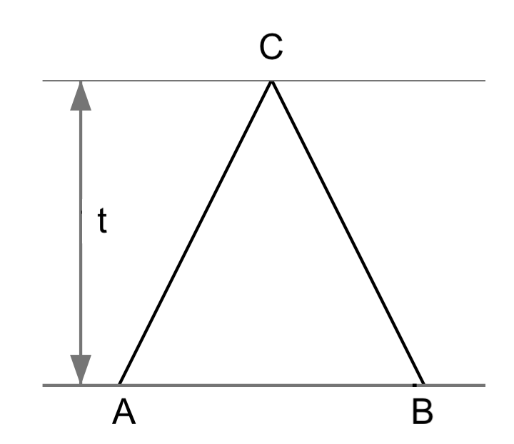

# Assignment 1 : Pairwise Sequence Alignment (15 points)

Due date: Fri 22/Mar/2024 at 23:59

## Instruction

Please rename the file and add your name and UPI into the file name, 
and then replace the author into your name in the header, 
including UPI insider the bracket.

This is an [R Markdown](http://rmarkdown.rstudio.com) Notebook,
which can be edited by [RStudio](https://posit.co/download/rstudio-desktop/). 
One of online guides is available at [bookdown.org](https://bookdown.org/yihui/rmarkdown/). 

**Note:** Some code has been given in order to define the input and output. 
Your code should be implemented between two comments "### your code here" and "### your code finished above". Please make sure that you do not miss any blocks, except for the example below:

```
# your code here
# ...
# your code finished above
```

All code must be executable in R 4.2.x or higher version. 
Tips: use `sessionInfo()` to print the R version.

## Question 1 (3 points)

Implement the Needleman–Wunsch algorithm for global sequence alignment. 
This implementation should be split into two parts:

- Complete the function `compute_F_matrix()`, which computes F matrix;
- Complete the function `trace_back()`, which implements the tracing back process.

To validate your implementation, you will test it in the last subsection and print the result.

### 1.1 F matrix

The function `compute_F_matrix(...)` below aims to fill a two-dimensional matrix, 
known as the `F` matrix.
Your task is to finalize the code by implementing a scoring system governed by three parameters, 
each with their default values: `match=1.0, mismatch=-1.0, gap=1.0`. 
In this function, *match* and *mismatch* together correspond to the scoring matrix, 
and *gap* denotes the linear gap penalty, to be applied as a positive value.
It's important to adjust the scoring accordingly in your implementation, 
ensuring that the gap penalty is subtracted during the calculation.
Upon successful completion, the function will generate and return the `F` matrix.

Please be aware that the columns of this matrix are designated with the characters from the first sequence, `A`, and the rows with characters from the second sequence, `B`. 
Furthermore, we use the variable `i` to index the rows and `j` to index the columns.

Please note: the matrix and indexing is different to the pseudo-code in Wikipedia. 

```{r, compute_F_matrix}
# given two sequence A and B,
# compute F matrix from given match/mismatch and gap penalty 
compute_F_matrix <- function(A, B, gap=1.0, match=1.0, mismatch=-1.0) {

  # init dimension of the matrix
  F <- matrix(0, ncol = nchar(A)+1, nrow = nchar(B)+1)
  # sequence A in col names, B in row names.
  colnames(F) <- c("*", unlist(strsplit(A, split = "")) )
  rownames(F) <- c("*", unlist(strsplit(B, split = "")) )
  
  # Array/matrix indexes start at 1.
  # fill in the first row with gap penalty scores (negative)
  F[,1] = - gap * 0:(nrow(F)-1)
  # fill in the first column with gap penalty scores (negative)
  F[1,] = - gap * 0:(ncol(F)-1)

  # start scoring. 
  for (i in 2:nrow(F)) {
    for (j in 2:ncol(F)) {
      # similarity to the scoring matrix but based on match and mismatch
      s = ifelse(colnames(F)[j] == rownames(F)[i], match, mismatch) 
      
      # the scoring system
      
      ### your code here
      # ...
      ### your code finished above
      
    }
  }
  
  return(F)
}
```

For testing your implementation with a new pair of sequences `x` and `y`, 
use the code snippet below. 
This will output the matrix `Fmat`, 
provided your code is fully implemented and contains no incomplete sections.

```{r}
x = "GCATGCG"
y = "GATTACA"

# test your implementation
Fmat <- compute_F_matrix(x, y)
Fmat
```


### 1.2 Tracing back

Finalize the function `trace_back(...)` to construct the alignment using the scoring matrix `F`, generated by `compute_F_matrix(...)` as implemented above, 
along with other necessary parameters.

In instances where multiple scores are identical, 
opt for the high road strategy during the traceback process. 
For instance, given a choice between moving vertically or diagonally, 
the high road strategy would prioritize a vertical move. 
Similarly, when the choice is between diagonal and horizontal moves, 
the diagonal direction should be chosen.

Please note: This high road approach deviates from the pseudo-code typically found on Wikipedia.


```{r, trace_back}
# form the alignment given a scoring matrix
trace_back <- function(F, A, B, gap=1.0, match=1.0, mismatch=-1.0) {
  # i indexing row, j indexing col in F
  i = nchar(B) + 1
  j = nchar(A) + 1
  if (i == 1 || j == 1 || i > nrow(F) || j > ncol(F)) {
    stop("Invalid position (", i, ", ", j, ") !")
  }
  
  # aligned sequence A is on the top
  AlignmentA = ""
  # aligned sequence B
  AlignmentB = ""
  
  # trace back in F matrix following the possible moves 
  # by recalculating the score,
  # the starting position is bottom right element in F matrix.
  # selected scores in the path.
  scores = c()
  while (i > 1 || j > 1) {
    # append score
    scores = c(scores, F[i, j])
    
    # similarity matrix is based on match and mismatch
    s = ifelse(colnames(F)[j] == rownames(F)[i], match, mismatch) 
    
    # the scoring system, note subtract gap penalty.
    
    ### your code here
    # ...
    ### your code finished above
    
    # the top-left cell is not used,
    # so B in row names starts from the 2nd row, A in col names from the 2nd col
    row_char = substring(B, i-1, i-1)
    col_char = substring(A, j-1, j-1)
    
    # create AlignmentA and AlignmentB
    
    ### your code here
    # ...
    ### your code finished above
    
  }
  
  # AlignmentA and AlignmentB are strings
  return(list(AlignmentA=AlignmentA, AlignmentB=AlignmentB))
}
```

### 1.3 Test algorithm and print alignments

```{r, global_alignment}
### 1st test, reuse the F matrix above
rs <- trace_back(Fmat, x, y)
# aligned sequence A on the top
cat("x: ", rs$AlignmentA, "\ny: ", rs$AlignmentB, "\n\n")

### 2nd test
x2 = "CGTGAATTCAT"
y2 = "GACTTAC"
# restart
Fmat2 <- compute_F_matrix(x2, y2)
rs2 <- trace_back(Fmat2, x2, y2)
cat("x: ", rs2$AlignmentA, "\ny: ", rs2$AlignmentB, "\n\n")
### End
```


## Question 2 (3 points)

Implement the algorithm for overlap (ends-free) sequence alignment.
This implementation should be split into two parts:

- Complete the function `compute_F_matrix()`, which computes F matrix;
- Complete the function `trace_back()`, which implements the tracing back process.

To validate your implementation, you will test it in the last subsection and print the result.

### 2.1 F matrix

The function `compute_F_matrix(...)` below aims to fill a two-dimensional matrix, 
known as the `F` matrix.
Your task is to finalize the code by implementing a scoring system governed by three parameters, 
each with their default values: `match=1.0, mismatch=-1.0, gap=1.0`. 
In this function, *match* and *mismatch* together correspond to the scoring matrix, 
and *gap* denotes the linear gap penalty, to be applied as a positive value.
It's important to adjust the scoring accordingly in your implementation, 
ensuring that the gap penalty is subtracted during the calculation.
Upon successful completion, the function will generate and return the `F` matrix.

Please be aware that the columns of this matrix are designated with the characters from the first sequence, `A`, and the rows with characters from the second sequence, `B`. 
Furthermore, we use the variable `i` to index the rows and `j` to index the columns.

Please note: the matrix and indexing is different to the pseudo-code in Wikipedia. 

```{r, compute_F_matrix}
# given two sequence A and B,
# compute F matrix from given match/mismatch and gap penalty 
compute_F_matrix <- function(A, B, gap=1.0, match=1.0, mismatch=-1.0) {

  # init dimension of the matrix
  F <- matrix(0, ncol = nchar(A)+1, nrow = nchar(B)+1)
  # sequence A in col names, B in row names.
  colnames(F) <- c("*", unlist(strsplit(A, split = "")) )
  rownames(F) <- c("*", unlist(strsplit(B, split = "")) )
  
  # then keep the default, 0, for the 1st row and 1st column
  # start scoring. 
  for (i in 2:nrow(F)) {
    for (j in 2:ncol(F)) {
      # similarity to the scoring matrix but based on match and mismatch
      s = ifelse(colnames(F)[j] == rownames(F)[i], match, mismatch) 
      
      # the scoring system
      
      ### your code here
      # ...
      ### your code finished above
      
    }
  }
  
  return(F)
}
```

For testing your implementation with a new pair of sequences `x` and `y`, 
use the code snippet below. 
This will output the matrix `Fmat`, 
provided your code is fully implemented and contains no incomplete sections.

```{r}
x = "ATA"
y = "AGTTA"

# test your implementation
Fmat <- compute_F_matrix(x, y)
Fmat
```


### 2.2 Tracing back

Finalize the function `trace_back(...)` to construct the alignment using the scoring matrix `F`, generated by `compute_F_matrix(...)` as implemented above, 
along with other necessary parameters.

In instances where multiple scores are identical, 
opt for the high road strategy during the traceback process. 
For instance, given a choice between moving vertically or diagonally, 
the high road strategy would prioritize a vertical move. 
Similarly, when the choice is between diagonal and horizontal moves, 
the diagonal direction should be chosen.

Please note: This high road approach deviates from the pseudo-code typically found on Wikipedia.


```{r, trace_back}
# form the alignment given a scoring matrix
trace_back <- function(F, A, B, gap=1.0, match=1.0, mismatch=-1.0) {
  
  # take the max score of the last column and last row
  max_score = max(F[,ncol(F)], F[nrow(F),])
  
  # if there are multiple maximum scores
  # ???
  coord = which(F==max_score, arr.ind=TRUE)
  # max_i, max_j are the coordinate of the highest score max_score in F matrix. 
  max_i = coord[nrow(coord),1]  
  max_j = coord[nrow(coord),2]
  
  # aligned sequence A is on the top
  AlignmentA = ""
  # aligned sequence B
  AlignmentB = ""
  
  # trace back 
  i = max_i
  j = max_j
  scores = c()
  # stop as soon as hit the 1st row or 1st col
  while (i > 1 && j > 1) { 
    # append score
    scores = c(scores, F[i, j])
    
    # similarity matrix is based on match and mismatch
    s = ifelse(colnames(F)[j] == rownames(F)[i], match, mismatch) 
    
    # the top-left cell is not used,
    # so B in row names starts from the 2nd row, A in col names from the 2nd col
    row_char = substring(B, i-1, i-1)
    col_char = substring(A, j-1, j-1)
    
    # Reuse the scoring system, note subtract gap penalty.
    # Then, create AlignmentA and AlignmentB.
    
    ### your code here
    # ...
    ### your code finished above
    
    # for debugging, if you have a problem
    #cat("selected scores = (", paste(scores, collapse = ", "), ")\n") 
  }
  
  # AlignmentA and AlignmentB are strings
  return(list(AlignmentA=AlignmentA, AlignmentB=AlignmentB, max_score=max_score, max_i=max_i, max_j=max_j))
}
```

### 2.3 Test algorithm and print alignments

```{r, global_alignment}
### 1st test, reuse the F matrix above
rs <- trace_back(Fmat, x, y)
# aligned sequence A on the top
cat("x: ", rs$AlignmentA, "\ny: ", rs$AlignmentB, "\n\n")

### 2nd test
x2 = "CTAAGGGATTCCGGTAATTAGACAG"
y2 = "ATAGACCATATGTCAGTGACTGTGTAA"
# restart
Fmat2 <- compute_F_matrix(x2, y2)
rs2 <- trace_back(Fmat2, x2, y2)
cat("x: ", rs2$AlignmentA, "\ny: ", rs2$AlignmentB, "\n\n")
### End
```


## Question 2 (3 points)





$$
x = \frac{-b \pm \sqrt{b^2 - 4ac}}{2a}
$$


## Question 3 (9 points)

In this section, we will use R to construct phylogenetic trees using some basic algorithms, such as UPGMA and Neighbour-joining, etc, and answer some questions.
Please make sure that you do not miss any blocks shown below, and replace the "Your answer" to your actual answer of that quetion.

```
Your answer
```

Please download the nucleotide alignment, and save it into your working directory.
You can preview the alignment by using any text editor to open the file.

We also need these R libraries: "ape", "phangorn", "phytools", "tidyverse", and "Biostrings". 
These libraries except of "Biostrings" can be installed using the `install.packages` function and loaded using the `library` function. For example use `install.packages("ape")` followed by `library(ape)`. In addtion, you need to follow the [installation instruction](https://bioconductor.org/packages/release/bioc/html/Biostrings.html)
to use "BiocManager" to install "Biostrings".

```{r, setup, include=FALSE}
library(tidyverse)
library(ape)
library(Biostrings)
library(phangorn)
library(phytools)

# please replace to your working dir
knitr::opts_knit$set(root.dir = "~/WorkSpace/BioSci700/Assignment1")
```


### 3.1 Pairwise distances

Make sure the alignment file is in your working directory, then load the alignment from the fasta file:

```{r}
#getwd()
aln = read.FASTA("ABCD.fasta")
```

This alignment has 4 taxa and 20 sites. The nucleotides were composited to create the distance matrix.

Using the function `dist.dna` to compute the distribution of pairwise distances, we can multiple it with the number of sites (20) to obtain the matrix of pairwise distances.

```{r}
# 20 sites
d = dist.dna(aln, model = "raw") * 20
d
```

**Question 3.1:** describe the relationships between the taxa based on this distance matrix.

```
Your answer
```

### 3.2 Algorithms

Secondly, we will use the libraries “phangorn” and “phytools” to create and plot trees. 
Please note you need to use [Dingue virus data](./Dengue4.env.nex) to make the following analysis.

```{r}
sq = read.nexus.data("Dengue4.env.nex")
# convert the list of vectors into DNAbin object
# so phangorn functions can take it as the input
m <- sq %>% lapply(.,paste0,collapse="") %>% 
  unlist %>% DNAStringSet %>% as.DNAbin 
```

3.2.1 UPGMA

Now, we will compute the distance matrix d and produce the UPGMA tree. 
Use `plot` function to draw the tree, and use `edgelabels` to show branch lengths.

```{r}
dm  <- dist.ml(m)

treeUPGMA <- upgma(dm)
plot(treeUPGMA, use.edge.length=T, no.margin=TRUE)
edgelabels(round(treeUPGMA$edge.length,4)) 
```

3.2.2 Neighbour-joining

Then compute the neighbour-joining tree. As it produces unrooted trees, 
you need to add the “unrooted” argument to the `plot` function.

```{r}
treeNJ <- NJ(dm)
plot(treeNJ, type="unrooted", use.edge.length=T, no.margin=TRUE)
#edgelabels(round(treeNJ$edge.length,4))
```

**Question 3.2:** what is pros and cons of the neighbour-joining algorithm?

```
Your answer
```

3.2.3 Parsimony

Print the parsimony scores.

```{r}
parsimony(c(treeUPGMA, treeNJ), as.phyDat(m))
```

Which tree should be used as a starting tree?

We then use the UPGMA tree as a starting tree, and perform nearest-neighbor interchanges (NNI) to find the maximum parsimony tree.

```{r}
treePars <- optim.parsimony(treeUPGMA, as.phyDat(m), rearrangements = "NNI")
plot(treePars, type="unrooted", use.edge.length=T, no.margin=TRUE)
```

3.2.4 Maximum likelihood

We are going use [iqtree2](http://www.iqtree.org/#download) for this section,
please install the latest version before you start.

Run iqtree2 using the following command in the terminal, but replace "$YOUR_PATH" 
into the directory path of iqtree2, e.g. "/Applications/iqtree2.2.0/bin"

```bash
$YOUR_PATH/iqtree2 -s Dengue4.env.nex
```
Load the maximum-likelihood tree to R, e.g. "Dengue4.env.nex.treefile":

Analysis results are written to: 
```
IQ-TREE report:                Dengue4.env.nex.iqtree
Maximum-likelihood tree:       Dengue4.env.nex.treefile
Likelihood distances:          Dengue4.env.nex.mldist
Screen log file:               Dengue4.env.nex.log
```

```{r}
treeML <- read.tree("Dengue4.env.nex.treefile")
plot(treeML, use.edge.length=T, no.margin=TRUE)
```

When you make a data analysis using the model-based approach, you need to know which model fits the best for the given data.

**Question 3.3:**
Use any text file editor to open "Dengue4.env.nex.iqtree", and answer which nucleotide substitution model fit the best for Dengue data. Why?

```
Your answer
```

**Question 3.4:**

- Compare the differences in tree topology between the trees generated by four different algorithms.

- In addition, use `treedist` function in `phangorn` to compare again, 
and explain what the result tells you.

```
Your answer
```

3.2.5 Tree distance


TODO

