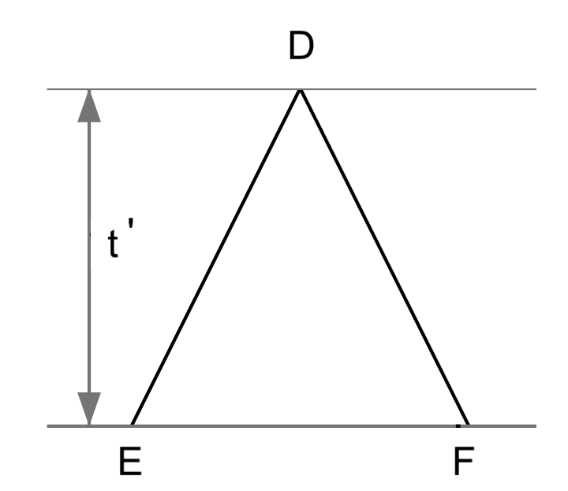

# Assignment 1 : Pairwise Sequence Alignment (15 points)

Due date: Fri 22/Mar/2024 at 23:59

## Instruction

Please rename the file and add your name and UPI into the file name, 
and then replace the author into your name in the header, 
including UPI insider the bracket.

This is an [R Markdown](http://rmarkdown.rstudio.com) Notebook,
which can be edited by [RStudio](https://posit.co/download/rstudio-desktop/). 
One of online guides is available at [bookdown.org](https://bookdown.org/yihui/rmarkdown/). 

**Please note:** Some code has been given in order to define the input and output. 
Your code should be implemented between two comments "### your code here" and "### your code finished above". Please make sure that you do not miss any blocks, except for the example below:

```
# your code here
# ...
# your code finished above
```

It is important to maintain clean and well-commented code for proper assessment,
failure to do so will have a negative impact on your score.

All code must be executable in R 4.2.x or higher version. 
Tips: use `sessionInfo()` to print the R version.


**Please note:** Some subsections will require you to answer questions. Please make sure that you do not miss any blocks, except for the example below. Replace the "Your answer" with your actual answer to each question (maximum 100 words).

**Answer starts:**
Your answer
**Answer ends**


## Question 1 (3 points)

Implement the algorithm for overlap (ends-free) sequence alignment.
This implementation should be split into two parts:

- Complete the function `compute_F_matrix()`, which computes F matrix;
- Complete the function `trace_back()`, which implements the tracing back process.

To validate your implementation, you will test it in the last subsection and print the result.

### 1.1 F matrix

The function `compute_F_matrix(...)` below aims to fill a two-dimensional matrix, 
known as the `F` matrix.
Your task is to finalize the code by implementing a scoring system governed by three parameters, 
each with their default values: `match=1.0, mismatch=-1.0, gap=1.0`. 
In this function, *match* and *mismatch* together correspond to the scoring matrix, 
and *gap* denotes the linear gap penalty, to be applied as a positive value.
It's important to adjust the scoring accordingly in your implementation, 
ensuring that the gap penalty is subtracted during the calculation.
Upon successful completion, the function will generate and return the `F` matrix.

Please be aware that the columns of this matrix are designated with the characters from the first sequence, `A`, and the rows with characters from the second sequence, `B`. 
Furthermore, we use the variable `i` to index the rows and `j` to index the columns.

Please note: the matrix and indexing is different to the pseudo-code in Wikipedia. 

```{r, compute_F_matrix}
# given two sequence A and B,
# compute F matrix from given match/mismatch and gap penalty 
compute_F_matrix <- function(A, B, gap=1.0, match=1.0, mismatch=-1.0) {
  
  # init dimension of the matrix
  F <- matrix(0, ncol = nchar(A)+1, nrow = nchar(B)+1)
  # sequence A in col names, B in row names.
  colnames(F) <- c("*", unlist(strsplit(A, split = "")) )
  rownames(F) <- c("*", unlist(strsplit(B, split = "")) )
  
  # then keep the default, 0, for the 1st row and 1st column
  # start scoring. 
  for (i in 2:nrow(F)) {
    for (j in 2:ncol(F)) {
      # similarity to the scoring matrix but based on match and mismatch
      s = ifelse(colnames(F)[j] == rownames(F)[i], match, mismatch) 
      
      # the scoring system
      
      ### your code here
      # ...
      ### your code finished above
      
    }
  }
  
  return(F)
}
```

For testing your implementation with a new pair of sequences `x` and `y`, 
use the code snippet below. 
This will output the matrix `Fmat`, 
provided your code is fully implemented and contains no incomplete sections.

```{r}
x = "AGTCCGT"
y = "CGTGAAGT"

# test your implementation
Fmat <- compute_F_matrix(x, y)
Fmat
```


### 1.2 Tracing back

Finalize the function `trace_back(...)` to construct the alignment using the scoring matrix `F`, generated by `compute_F_matrix(...)` as implemented above, 
along with other necessary parameters.

In instances where multiple scores are identical, 
opt for the high road strategy during the traceback process. 
For instance, given a choice between moving vertically or diagonally, 
the high road strategy would prioritize a vertical move. 
Similarly, when the choice is between diagonal and horizontal moves, 
the diagonal direction should be chosen.

Please note: This high road approach deviates from the pseudo-code typically found on Wikipedia.


```{r, trace_back}
# form the alignment given a scoring matrix
trace_back <- function(F, A, B, gap=1.0, match=1.0, mismatch=-1.0) {
  
  # take the max score of the last column and last row
  max_score = max(F[,ncol(F)], F[nrow(F),])
  
  # if there are multiple maximum scores,
  # the last column is prioritized. 
  coord = which(F==max_score, arr.ind=TRUE)
  # max_i, max_j are the coordinate of the highest score max_score in F matrix. 
  max_i = coord[nrow(coord),1]  
  max_j = coord[nrow(coord),2]
  
  # add the non-overlap part in the end
  # the end of non-overlap part should start from nchar(shortest_str) + 1, 
  # but the alignment already starts from the 2nd row/col, so not plus 1 for max_i. 
  endB = substr(B, max_i, nchar(B))
  endA = substr(A, max_j, nchar(A))
  # add the white space to make the end part in a same length
  if (nchar(endA) > nchar(endB)) {
    endB = paste0( endB, strrep(" ", nchar(endA) - nchar(endB)) )
  } else if (nchar(endA) < nchar(endB)) {
    endA = paste0( endA, strrep(" ", nchar(endB) - nchar(endA)) )
  }
    
  # aligned sequence A is on the top
  AlignmentA = endA
  # aligned sequence B
  AlignmentB = endB
  # for debug
  #cat("endA :", endA, "\nendB :", endB, "\n")
  
  # trace back 
  i = max_i
  j = max_j
  scores = c()
  # stop as soon as hit the 1st row or 1st col
  while (i > 1 && j > 1) { 
    # append score
    scores = c(scores, F[i, j])
    
    # similarity matrix is based on match and mismatch
    s = ifelse(colnames(F)[j] == rownames(F)[i], match, mismatch) 
    
    # the top-left cell is not used,
    # so B in row names starts from the 2nd row, A in col names from the 2nd col
    row_char = substring(B, i-1, i-1)
    col_char = substring(A, j-1, j-1)
    
    # Reuse the scoring system, note subtract gap penalty.
    # Then, create AlignmentA and AlignmentB.
    
    ### your code here
    # ...
    ### your code finished above

    # for debugging, if you have a problem
    #cat("selected scores = (", paste(scores, collapse = ", "), ")\n") 
  }
  
  # add the non-overlap part in the beginning
  startB = substr(B, 1, i-1)
  startA = substr(A, 1, j-1)
  # add the white space to make the end part in a same length
  if (nchar(startA) > nchar(startB)) {
    startB = paste0( strrep(" ", nchar(startA) - nchar(startB)), startB)
  } else if (nchar(startA) < nchar(startB)) {
    startA = paste0( strrep(" ", nchar(startB) - nchar(startA)), startA)
  }
    
  AlignmentA = paste0(startA, AlignmentA)
  AlignmentB = paste0(startB, AlignmentB)
  # for debug
  #cat("startA :", startA, "\nstartB :", startB, "\n")
  
  # AlignmentA and AlignmentB are strings
  return(list(AlignmentA=AlignmentA, AlignmentB=AlignmentB, max_score=max_score, max_i=max_i, max_j=max_j))
}
```

### 1.3 Test algorithm and print alignments

```{r, global_alignment}
### 1st test, reuse the F matrix above
rs <- trace_back(Fmat, x, y)
cat("Sequence x: ", x, "\nSequence y: ", y, "\n\n")
# aligned sequence A on the top
cat("Alignment x: ", rs$AlignmentA, "\nAlignment y: ", rs$AlignmentB, "\n")
cat("max_score = ", rs$max_score, ", max_i = ", rs$max_i, ", max_j = ", rs$max_j, "\n\n")

### 2nd test
x2 = "CTAAGGGATTCCGGTAATTAGACAG"
y2 = "ATAGACCATATGTCAGTGACTGTGTAA"
# restart
Fmat2 <- compute_F_matrix(x2, y2)
rs2 <- trace_back(Fmat2, x2, y2)
cat("Sequence x: ", x2, "\nSequence y: ", y2, "\n\n")
cat("Alignment x: ", rs2$AlignmentA, "\nAlignment y: ", rs2$AlignmentB, "\n")
cat("max_score = ", rs2$max_score, ", max_i = ", rs2$max_i, ", max_j = ", rs2$max_j, "\n\n")
### End
```


## Question 2 (6 points)

The Jukes-Cantor model is the simplest evolutionary model for DNA sequences, 
which assumes that all mutations occur at the same rate and the four nucleotides occur with equal frequency.

In this section, your understanding of the Jukes-Cantor (JC) model will be assessed through the completion of the following tasks:

- developing functions to simulate DNA sequences based on the principles of the JC model;
- reporting the differences across each pair of the simulated sequences;
- simulating 1000 pairs of sequences, and reporting the required statistical summary;
- calculating the observed probabilities that a given base is aligned to base $X$ within your simulated sequences;
- deriving the equation of theoretical probabilities.


### 2.1 Simulate DNA sequences

Given the figure below, sequence D is the most recent common ancestor of sequences E and F.
The time from E to the common ancestor D is $t$ time units. 
If you cannot see the figure, right-click your mouse and select the "reload".



You need to write R code to simulate pairs of sequences (E, F) diverging from a common ancestor $t$ time units in the past, utilizing the Jukes-Cantor model of evolution. 
In this question, the implementation is segmented into three modular functions for clarity and reusability. 

Initially, considering the ease of simulation, 
we opt for integer representations of nucleotide bases over character strings. 
The first function `numbers_to_nucletides` is designed to convert nucleotide base index/indices, 
whether a single integer or a vector of integers, 
back into their corresponding nucleotide characters, such as {A, C, G, T} in the predefined order,
and return the result as one string.


```{r, numbers_to_nucletides}
# give a single integer or a vector of integers
numbers_to_nucletides <- function(int_array) {
  # Define the order
  nucletides <- c("A", "C", "G", "T")
  
  ### your code here
  # ...
  ### your code finished above
  # return the result as one string.
}

# test your code here
numbers_to_nucletides(c(1, 2, 3, 4, 2, 4, 3, 1))
```

As we learnt, we can observe the substitutions between E and F, but the actual number of mutation events that have occurred since diverging from their common ancestor D remains unknown. 
The Jukes-Cantor model provides a straightforward framework for solving this problem during DNA sequence evolution.

The model assumes that each site mutates independently at a uniform rate, $\mu$.
Consequently, the rate at which any given nucleotide transitions to any of the three other nucleotides is $\frac{3}{4}\mu$.
Over time, this mutation process aligns with a Poisson distribution, with the expected rate of mutations being $\frac{3}{4}\mu t$, where $t$ represents the evolutionary time from the common ancestor D to either descendant E or F.

Moreover, upon a substitution event, the probability of a nucleotide to mutate to the three alternatives is equal to $\frac{1}{3}$. 

Complete the `mutate_site` function provided below. 
This function returns the final nucleotide (as integer) after a series of mutations from an initial nucleotide, `start_nuc` (as integer). 
The rest input parameters include the mutation rate $\mu$, evolutionary time $t$, and a mutation probability matrix.

This matrix `mutation_prob_matrix`, with rows and columns indicated by {A, C, G, T}, denotes the likelihood of a substitution event from a nucleotide (indicated by the row labels) to mutate to each of the three alternatives (indicated by the column labels).
The diagonal elements of the matrix are set to 0. 
You can take the corresponding row in the matrix as weights to the `sample` function, sampling the nucleotide after substitution.

Tips: use `rpois` to sample a value from a Poisson distribution. 
Also check the function `sample` for sampling a value from a uniform distribution.


```{r, mutate_site}
# mutation_prob_matrix is the probability matrix to choose from the 3 possible bases to mutate.
mutate_site <- function(start_nuc, mu, t, mutation_prob_matrix = 
                          matrix(c(0, 1/3, 1/3, 1/3,
                                   1/3, 0, 1/3, 1/3,
                                   1/3, 1/3, 0, 1/3,
                                   1/3, 1/3, 1/3, 0), byrow = TRUE, ncol = 4)) {
  # number of substitutions at this site
  
  ### your code here
  # nr_of_mutations <- ...
  ### your code finished above
  
  #cat("nr_of_mutations = ", nr_of_mutations, "\n")
  
  # start_nuc is integer
  mutations <- c(start_nuc)
  # avoid exception
  if (nr_of_mutations > 0) {
    # simulate each substitution in the repetition of nr_of_mutations
    
    ### your code here
    # ...
    ### your code finished above
  
  }
  
  return(mutations[length(mutations)])
}

# test this function
mutate_site(1, mu=0.01, t=10)
```

Now we can simulate the sequences using the function `simulate_seqs`.
Inputs for the function include the sequence length `L`, the mutation rate $\mu$, and evolutionary time `t`.
The output of the function comprises strings representing the ancestral sequence (D in the diagram) and the two descendant sequences (E and F in the diagram), each composed of the nucleotides {A, C, G, T}.

You can start from simulating the ancestral sequence (D), assuming the distribution for the sequence is uniform over the four possible bases at each site.
Then use the function `mutate_site` to simulate each site of E and F.

In the end, call `simulate_seqs` to simulate a pair of sequences of length 50 with $\mu$ = 0.01 and $t$ = 10, and print the resulting sequences along with the ancestral sequence. 

Tips: use R vectorization instead of loops can make your code faster, such as `sapply`.


```{r, simulate_seqs}
simulate_seqs <- function(L, mu, t) {
  
  ### your code here
  # ...
  ### your code finished above
  
  # Convert numbers to nucletides 
  D_nucletides <- numbers_to_nucletides(D)
  E_nucletides <- numbers_to_nucletides(mutated_E)
  F_nucletides <- numbers_to_nucletides(mutated_F)
  
  return(list(D = D_nucletides, E = E_nucletides, F = F_nucletides))
}

res = simulate_seqs(L=50, mu=0.01, t=10)
cat("D: ", res$D, "\n")
cat("E: ", res$E, "\n")
cat("F: ", res$F, "\n\n")
```

### 2.2 Report the difference

Report the number of differing sites between each sequence and the ancestral sequence, as well as between sibling sequences (i.e., D-E, D-F, and E-F).

The function `show_diff` provided below serves as a sample to assist with debugging and can be utilized as a reference to help you fulfill the requirements of the subsequent function.

```{r, show_diff}
show_diff <- function(seq1, seq2, seq3) {
  # Split strings into character vectors
  charVec1 <- strsplit(seq1, "")[[1]]
  charVec2 <- strsplit(seq2, "")[[1]]
  charVec3 <- strsplit(seq3, "")[[1]]
  
  m_char <- rbind(charVec1, charVec2, charVec3)
  # check if all values in a column are the same
  cols_to_remove <- apply(m_char, 2, function(x) { length(unique(x)) == 1 })
  
  # keep columns where not all values are the same
  m_char[, !cols_to_remove]
}

# res is from the "simulate_seqs" code block
show_diff(res$D, res$E, res$F)
```

Complete the function `count_diff` and report the difference of simulated sequences generated from the `simulate_seqs` code block

```{r, count_diff}
count_diff <- function(seq1, seq2) {
  
  ### your code here
  # ...
  ### your code finished above
  
}

# res is from the "simulate_seqs" code block
cat("Number of differences between D and E is", count_diff(res$D, res$E), "\n")
cat("Number of differences between D and F is", count_diff(res$D, res$F), "\n")
cat("Number of differences between E and F is", count_diff(res$E, res$F), "\n")
```


### 2.3 Simulate pairs of DNA sequences

Simulate 1000 pairs of sibling sequences (E and F) of length 1000 with with $\mu$ = 0.01 and $t$ = 25.
Utilize the previously developed code to compute the number of sites at which each pair differs. Calculate and print the mean and variance of the number of differing sites across all pairs.

```{r, simulate_1000}

  ### your code here
  # number_diff <- ...
  ### your code finished above


# Calculate mean and variance
cat("Mean number of differences between E and F:", mean(number_diff), "\n")
cat("Variance of number of differences between E and F:",  var(number_diff), "\n")
```


### 2.4 Compare the simulated probabilities with expected probabilities

Simulate a pair of sibling sequences (E and F) of length 10000 with $t$ = 10 and $\mu$ = 0.03.
Use them to calculate the probabilities $p_{GX}$, that a $G$ in the sequence E is aligned to base $X$ for $X ∈ \{A, C, G, T\}$ in the sequence F.

Tips: use R function `gregexpr` to find the indices of a sequence in string having "G",
and apply them to the vector returned by R function `strsplit`. 
Also check R function `table` for computing the frequencies of A C G T.


```{r, estimated_prob}

  ### your code here
  # ...
  ### your code finished above

```

### 2.5 The theoretical probabilities.

Assume that $p_{ab} = p_{ba}$. Write down the equation to calculate the theoretical values of $p_{GX}$ given $t$ (defined in the figure) and $\mu$, where estimated $p_{GX}$ were summarized in the previous subsection.
Please note the definition of $t$ and $\mu$ has been changed in this assignment.
You need to consider these changes when writing the equation. 

Tips: use the `$$` block, if you are not familiar, you learn it from https://rmd4sci.njtierney.com/math.

**Answer starts:**

Your answer

**Answer ends**


In addition, please print these theoretical probabilities calculated from the above equation, and validate your estimates in the previous subsection.


```{r, expected_prob}

  ### your code here
  # ...
  ### your code finished above

```


## Question 3 (6 points)

In this section, we will use some R scripts to construct phylogenetic trees using some basic algorithms, such as UPGMA and Neighbour-joining, etc, and answer some questions.

We also need these R libraries: "ape", "phangorn", "phytools", "tidyverse", and "Biostrings". 
These libraries can be installed using the `install.packages` function and loaded using the `library` function. For example use `install.packages("ape")` followed by `library(ape)`.
But "Biostrings" has to install separatedly by following the online instruction :   https://bioconductor.org/packages/release/bioc/html/Biostrings.html


```{r, setup, include=FALSE}
library(tidyverse)
library(ape)
library(Biostrings)
library(phangorn)
library(phytools)

# please replace to your working dir
knitr::opts_knit$set(root.dir = "~/WorkSpace/BioSci700/Assignment1")
```


Please download the nucleotide alignment, [RSV2.nex](./RSV2.nex), and save it into your working directory. 
This alignment comprised of 129 molecular sequences coding for RSVA’s G protein (Zlateva et al., 2004; Zlateva et al., 2005)
You can preview the alignment by using any text editor to open the file.
Please check the file extension, if you cannot load the file, 
sometime your OS system may add ".txt" to the downloaded file automatically.

The following R code will create a "DNAbin" object from the imported alignment,
which will be used in the next few questions.

```{r, import_alignment}
#getwd()
sq = read.nexus.data("RSV2.nex")
# convert the list of vectors into DNAbin object
aln <- sq %>% lapply(.,paste0,collapse="") %>% 
  unlist %>% DNAStringSet %>% as.DNAbin 
aln
```


### 3.1 Pairwise distances from DNA sequences

Write R code to use the function `dist.dna` to compute two separated matrices of pairwise distances from DNA sequences in the alignment `aln` using :

1. `model = "raw"`
2. `model = "JC69"`

Print the sum of each distance matrix.


```{r, distance_matrix}

  ### your code here
  # ...
  ### your code finished above

```

**Question 3.1:**

Read the R document of the function `dist.dna` by typing `?dist.dna` in R console.
Use the term you learned from the lecture to classify what type of distances are in these two matrices. Then explain why the sum of one distance matrix is smaller than the other.

**Answer starts:**

Your answer

**Answer ends**


### 3.2 model-based UPGMA

From this subsection until the end of the section, we will use the distance matrix computed by JC69 model. Please make sure you call the correct variable in the following R scripts. 

The task is to write a R script, which utilizes the function `upgma` taking the given distance matrix as input to construct UPGMA tree, and subsequently summaries the resultant phylogenetic tree using the function `summary.phylo`. In the end, write the tree into a file called "RSV2-UPGMA.tre" in the Newick format, using the function `write.tree`.

You can use a web-based tool "icytree" (https://icytree.org) to visualize tree and export it.   
Click "File" menu and select "Export tree as ..." to export your tree into a ".svg" file,
so that it can be loaded into the notebook as your answer. 
Please rename the file into "RSV2-UPGMA.svg".

Please make sure you submit both files "RSV2-UPGMA.tre" and "RSV2-UPGMA.svg" with this assignment.


```{r, upgma}

  ### your code here
  # ...
  ### your code finished above

```

After placing your svg into the current working directory, you can show it by right-clicking your mouse and selecting the "reload".


### 3.3 Neighbour-joining

In this subsection, we will write the script to construct the neighbour-joining tree using the function `NJ` and the same distance matrix. Then, repeat the same process: summarise tree, write tree, export tree to svg, and load it into the notebook.

Please make sure you submit both files "RSV2-NJ.tre" and "RSV2-NJ.svg" with this assignment.


```{r, neighbour_joining}

  ### your code here
  # ...
  ### your code finished above

```

Right-clicking your mouse and selecting the "reload", after the svg file is ready.


### 3.4 Parsimony

Run the follow code to print the parsimony scores between the UPGMA tree and neighbour-joining tree. 
If you are using different variable names, please update them accordingly.

```{r, parsimony_starting_tree}
parsimony(c(treeUPGMA, treeNJ), as.phyDat(aln))
```

Which tree should be used as a starting tree?

We then select the starting tree tree, and perform nearest-neighbor interchanges (NNI) to find the maximum parsimony tree. The function `optim.parsimony` will help you to do this.
Read its R document, if you are not sure how to setup the parameters as required.
Then, repeat the same process: summarise tree, write tree, export tree to svg, and load it into the notebook.

Please make sure you submit both files "RSV2-Parsimony.tre" and "RSV2-Parsimony.svg" with this assignment.


```{r, parsimony}

  ### your code here
  # ...
  ### your code finished above

```

Right-clicking your mouse and selecting the "reload", after the svg file is ready.


### 3.5 Compare trees

We can see the differences between those trees. But how can we quantify the difference?
One common approach is to computes tree distance. Please use `treedist` function in `phangorn` to compare the UPGMA tree and neighbour-joining tree that you constructed previously.


```{r, treedist}

  ### your code here
  # ...
  ### your code finished above

```


**Question 3.2:**
Then explain what "symmetric.difference" measures and how to interpret it.

**Answer starts:**

Your answer

**Answer ends**


