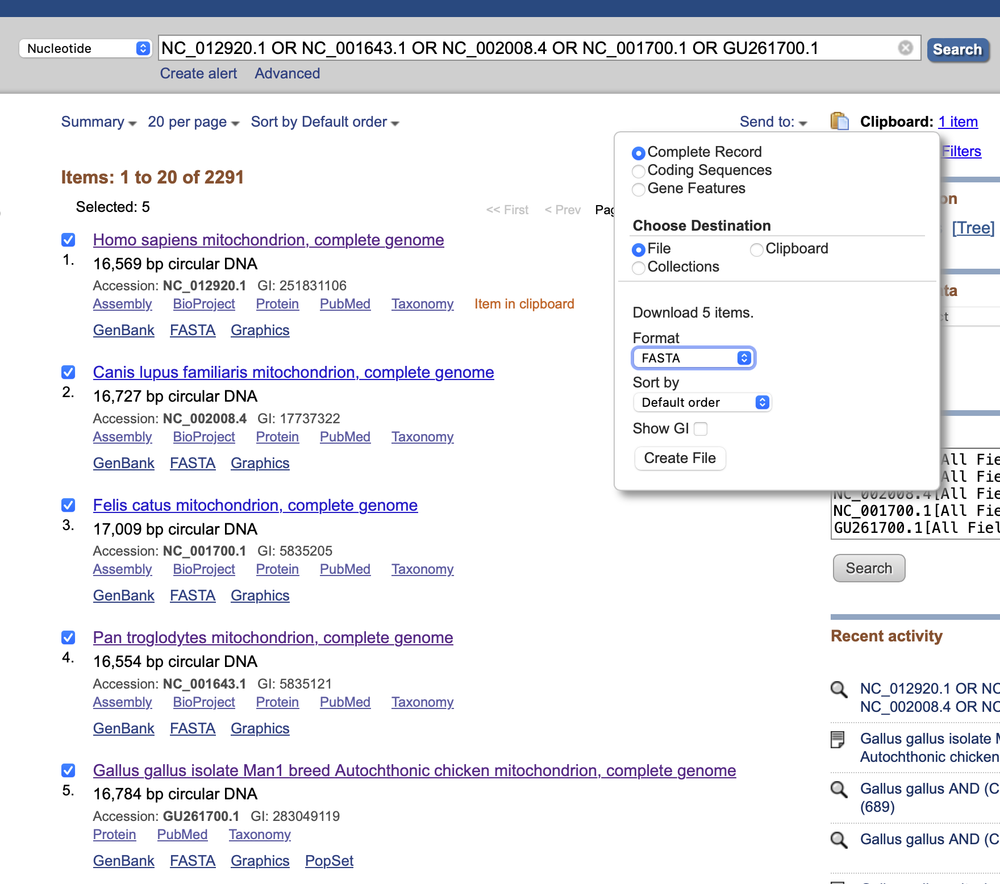

## Assignment1 : Alignment and Phylogenetic Reconstruction (25 marks)

Due date: 29th March 2025

Your name (UPI)


## Instructions for report submission

  1. Report Format & Template Usage

Write your report using this template and save it as a PDF file.
You may use [Overleaf](https://www.overleaf.com), MS Word, or Google Docs, and then export the final report as a PDF.
The PDF file name must include your name and UPI for identification.

{:start="2"}
  2. Completing the Report

Update the author section in the template with your name and UPI in the header.
Copy all section and subsection titles from the template, along with the questions, and then provide your answers accordingly. Avoid copying the instructions to minimize the number of pages.
Follow all instructions carefully to ensure proper setup and accurate responses from software tools.
The questions are numbered in Roman numerals (e.g., **Question i:**). Please remove the asterisks and adjust the font size to a more suitable one when copying the markdown template.

{:start="3"}
  3. Answering Questions

Your responses should be written inside the designated answer blocks.
Ensure that no answer blocks are left blank, except for the example provided in the template.
Replace Your answer with your actual response, limiting each answer to a maximum of 150 words.
For questions requiring screenshots, ensure all images are clear and legible.

Example format:

**Answer starts:**

Your answer

**Answer ends**

{:start="4"}
  4. Finalising & Submitting Your Report

Ensure all questions are answered and that your report is in PDF format.
Verify that your report opens correctly before submission.
Include all relevant figures, along with necessary log and tree files (e.g., iqtree’s tree file *.treefile and log file *.log).

{:start="5"}
  5. File Compression & Naming (optional)

To reduce submission size, compress all your files and sub-folders using the ZIP format only.
The ZIP file must be named with your name and UPI for easy identification.
Before submitting, ensure that the ZIP file can be extracted properly.

By following these instructions, you will ensure a clear, well-organized, and properly formatted submission.

There are 23 points for all questions, and 2 points for **clarity** and a **well-structured** report.


## Project description

In this lab, we will learn downloading and preprocessing data, and explore widely used tools for sequence alignment and phylogenetic tree construction. To make the most of your lab time, please ensure that all [required software](https://walterxie.github.io/BioSci700/) is installed beforehand.


## 1. Multiple sequence alignment (MSA) application (11 points)

In this section, we will practice creating a multiple sequence alignment (MSA) using homologous sequences from different species. Specifically, we will work with mitochondrial DNA from the following five species:

* Homo sapiens (Human) NC_012920.1
* Pan troglodytes (Chimpanzee) NC_001643.1
* Canis lupus (Dog) NC_002008.4
* Felis catus (Cat) NC_001700.1
* Gallus gallus (Chicken) GU261700.1

### 1.1 Downloading and preprocessing data 

Use the provided accession numbers to download the sequences from the NCBI Nucleotide Database (https://www.ncbi.nlm.nih.gov/nuccore/). Follow these steps:

You can follow the following steps: 

1. Open the NCBI Nucleotide Database in a web browser;
2. In the search bar, enter: "NC_012920.1 OR NC_001643.1 OR NC_002008.4 OR NC_001700.1 OR GU261700.1";
3. Click the "Search" button and select the top five results;
4. Click "Send to"", choose "File", set the format to "FASTA", and click "Create file" to download;
5. Locate the downloaded file (usually named "sequence.fasta"") and move it to your working directory.

<figure class="image">
  <a href="./figs/NIH.png">
    
  </a>
  <figcaption>Fig 1: downloading sequences</figcaption>
</figure> 

For preparing the sequence file, open the FASTA file in a text editor and simplify the sequence labels by modifying the lines that start with ">".
You can use the find option to search for every ">".
Then, replace the long descriptions (e.g. NC_012920.1 Homo sapiens mitochondrion, complete genome) to a concise format (e.g. Human|NC_012920.1).


### 1.2 Pairwise sequence alignment

To begin, we must determine the most appropriate pairwise sequence alignment method for this analysis.

**Question i (2 points):** 
Should we apply the local or global alignment method when studying evolutionary history at the species level? Why?

**Answer starts:**

Your answer

**Answer ends**


### 1.3 Progressive multiple sequence alignment (MSA) method

Progressive MSA methods build alignments iteratively, starting with pairwise alignments and gradually adding more sequences to the alignment.

For this analysis, we will use the software [MAFFT](https://mafft.cbrc.jp/alignment/software/manual/manual.html) to perform a global alignment on the downloaded sequences.

To create the alignment file, "global.fasta", open the terminal and run the following command:

```bash
mafft --maxiterate 1000 --globalpair sequence.fasta > global.fasta
```


### 1.4 Pairwise distances

To begin, ensure the alignment file is located in your working directory. Then, enter the following R code into the RStudio console. This code will load the necessary R libraries and import the alignment from the FASTA file into R:

```R
# install.packages("ape")
# install.packages("phangorn")
library(ape)
library(phangorn)

# change this to your path
setwd("~/WorkSpace/BioSci700/Assignment1")
globAlign <- read.FASTA(file.path("data", "global.fasta"))
```

Next, modify the sequence names to retain only the `Species|Accession` portion, if you did not simplify them previously:

```R
# Modify sequence names (keep only "Species|Accession")
names(globAlign) <- sub("^([^ ]+\\|[^ ]+).*", "\\1", names(globAlign))
globAlign
```

Afterward, use the function `dist.ml` to create a distance matrix.
Pairwise distances are usually calculated based on a model of molecular evolution, which accounts for different rates of mutation at different positions within the sequence.

```R
dm  <- dist.ml(globAlign)
dm
```

**Question ii (2 points):** 
Which evolutionary model is used to compute the distances above? How should we interpret the distance matrix "dm" in the context of species evolution?

**Answer starts:**

Your answer

**Answer ends**


### 1.4 Phylogenetic reconstruction

We will practise three algorithms to construct phylogenetic tree:

1. UPGMA

First, we will use the previous distance matrix "dm" to construct the UPGMA tree in R. We can visualize the tree using the "plot" function, and display the branch lengths using "edgelabels":

```R
treeUPGMA <- upgma(dm)
plot(treeUPGMA, use.edge.length=T, no.margin=TRUE)
edgelabels(round(treeUPGMA$edge.length,4)) 
```

{:start="2"}
2. Neighbour-joining

Next, we will compute the neighbour-joining tree. Since the tree produced is unrooted, we need to specify the "unrooted" argument when plotting:

```R
treeNJ <- NJ(dm)
plot(treeNJ, type="unrooted", use.edge.length=T, no.margin=TRUE)
#edgelabels(round(treeNJ$edge.length,4))
```

**Question iii (2 points):** 
What are the key assumptions behind UPGMA and neighbour-joining algorithms? How do these assumptions affect the accuracy of the resulting phylogenetic trees?

**Answer starts:**

Your answer

**Answer ends**


{:start="3"}
3. Maximum likelihood

Here, we will construct a Maximum Likelihood (ML) phylogenetic tree using IQ-TREE 2. IQ-TREE is a widely used tool for phylogenetic analysis that selects the "best-fit" substitution model and builds the tree accordingly.

Use the following command to generate a Maximum Likelihood tree from the aligned sequence file (global.fasta).
Make sure to replace "MY_PATH" with the actual path to the directory containing iqtree2.

```bash
/MY_PATH/bin/iqtree2 -s global.fasta
```

Upon execution, IQ-TREE 2 automatically selects the most suitable DNA substitution model using ModelFinder and then infers the best Maximum Likelihood tree based on that model.

Check the log file generated by IQ-TREE (e.g., global.fasta.log). Identify the "best-fit" substitution model selected.

**Question iv (2 points):** 
What is the "best-fit" substitution model selected for this dataset? What is its log-likelihood?
Provide a brief but precise description of the selected model and why it might be suitable for this dataset.

**Answer starts:**

Your answer

**Answer ends**

The resulting Maximum Likelihood tree will be saved in the file "global.fasta.treefile".
Visualize the tree using a suitable tree viewer (e.g., FigTree, IcyTree, or R packages like ggtree).
Please attach the image with your answer below. Ensure tip labels are clearly visible in the image.

**Question v (2 points):** 
What is the unit of branch lengths in this tree? In addition, describe key observations for evolutionary relationships.

**Answer starts:**

Your answer

**Answer ends**


### 1.5 Tree-based alignment method

In this section, we introduce an alternative multiple sequence alignment (MSA) method that uses a phylogenetic tree to guide the alignment process. Unlike traditional progressive alignment methods, tree-based alignment incorporates evolutionary relationships to improve accuracy.

We will use [PRANK](https://ariloytynoja.github.io/prank-msa/docs/prank_installation.html) to perform tree-based alignment. 

Open the terminal and run the following command, using "global.fasta.treefile" as the guide tree:

```bash
prank -d=sequence.fasta -o=treeb -t=global.fasta.treefile -F -showxml
```

* -d=sequence.fasta : Input sequence file.
* -o=treeb : Output file prefix.
* -t=global.fasta.treefile : Uses the previously generated ML tree to guide alignment.
* -F : Keeps gap placement consistent with evolutionary history.
* -showxml : Outputs results in XML format for further analysis.

For more details, visit the webpage [PRANK differences](http://wasabiapp.org/software/prank/prank_differences/) or refer to [their publication](https://academic.oup.com/mbe/article/33/4/1126/2579418).


**Question vi (1 points):** 
How does a tree-based alignment method improve accuracy compared to other progressive methods?

**Answer starts:**

Your answer

**Answer ends**


## 2. Phylogenetic analysis with temporal data (4 points)

In this section and the next, we will use a combination of tools to uncover the evolutionary history from a dataset with known sampling dates.

Please download the prepared [alignment](./data/cov100.alg.fa), which are randomly subsampled from a large Delta SARS-CoV-2 outbreak in Aotearoa New Zealand ([Jelley et al. 2022](https://www.nature.com/articles/s41467-022-31784-5)). The alignment consists of 100 SARS-CoV-2  sequences from infected patients, and the file [Delta.txt](./data/Delta.txt) contains metadata, such as the sample location (by DHB), collection date, and more. Download the Delta.txt file for future use.

We will use the maximum likelihood (ML) method with IQ-TREE to construct a phylogenetic tree, and then apply TempEst to explore the temporal signal within the data.


### 2.1 Maximum likelihood tree

Run [IQ-TREE](http://www.iqtree.org/#download) on the dataset to construct the maximum likelihood tree. You can do this with the following command in the terminal:

```bash
/MY_PATH/bin/iqtree2 -s cov100.alg.fa
```

Once the analysis is complete, please attach the generated tree file (e.g., "cov100.alg.fa.treefile") and the IQ-TREE log file (e.g., "cov100.alg.fa.log") to your report. For detailed instructions, consult the online documentation and tutorials for IQ-TREE.

**Question i (1+1 points):** 
Please visualize the maximum likelihood tree and attach the resulting image below. 

**Advanced Requirement:**
As an additional challenge (+1 point), color the tips of the tree according to the sample locations. The file "Delta.txt" provides the mapping between taxon names and sample locations, and uses it to color the branches accordingly. 

**Answer starts:**

Your answer

**Answer ends**

### 2.2 Identify problems

Considering our goal of discovering evolutionary history through time, is it sufficient to only provide the phylogenetic tree constructed in the previous subsection?

**Question ii (2 points):** 
Please identify at least two potential issues that arise from using only the ML tree for temporal signal analysis and list them below:

**Answer starts:**

Your answer

**Answer ends**


## 3. Investigate temporal signal (8 points)

In this section, we will use [TempEst](http://tree.bio.ed.ac.uk/software/tempest/) to analyze the temporal signal of the maximum likelihood tree generated by IQ-TREE. TempEst is specifically designed for analyzing trees that have not been inferred under a molecular clock assumption, to assess how well this assumption holds. Additionally, it helps identify the optimal root position that is most compatible with the molecular clock hypothesis.

If you're unsure how to answer the following questions, please refer to the article by [Rambaut et al 2016](https://doi.org/10.1093/ve/vew007).

Launch TempEst and import the maximum likelihood tree file.
Familiarize yourself with the statistics displayed in the top-left corner of the interface.
Select "Import Date" to upload the downloaded file "Delta.txt" and replicate the settings shown in the image below to extract years from taxon labels.

<figure class="image">
  <a href="./figs/ParseDates.png">
    
  </a>
  <figcaption>Fig 2: parse date</figcaption>
</figure> 


<br>

Navigate to the "Tree" tab to view the visualized tree. Then proceed to the "Root-to-tip" tab to analyze the regression results.

Activate the "best-fitting root" option in the top-left corner to root the tree at the position that best aligns with the molecular clock hypothesis. Keep the default function as "heuristic residual mean squared".

### 3.1. Statistical results

Record the statistical results both before and after activating the "best-fitting root" option. Answer the question below:

**Question i (2 points):**
What are the statistical outcomes both prior to and subsequent to activating the 'best-fitting root' option? What are the implications of two key statistics, "Slope (rate)" and "X-Intercept (TMRCA)"?

**Answer starts:**

Your answer

**Answer ends**

### 3.2. The "best-fitting root" tree

After activating the "best-fitting root" option, navigate to the "Tree" tab.
Take a screenshot of the "best-fitting root" tree.
Please attach the image with your answer below. Ensure tip labels are clearly visible in the image.

**Question ii (1 point):**
Briefly describe the outcomes of analyzing this dataset using the "best-fitting root" option.

**Answer starts:**

Your answer

**Answer ends**

<br>

**Question iii (1 point):**
Look at both the "best-fitting root" tree and the root-to-tip plot, identify at least two problematic clades or taxa in the tree. Explain the indication of the problem by considering its position in the root-to-tip plot.

**Answer starts:**

Your answer

**Answer ends**

### 3.3. Exploring temporal signal

As [Rambaut et al 2016](https://doi.org/10.1093/ve/vew007) demonstrated, regressing root-to-tip genetic distance against sampling time can serve as a simple diagnostic tool for assessing molecular clock models.

Keep the same options in TempEst and navigate to the "Root-to-tip" tab. Use the number and figure to support your conclusions when answering the following questions.

**Question iv (2 points):** 
Does this dataset contain enough temporal signal to apply a molecular clock model? Explain why or why not. 

**Answer starts:**

Your answer

**Answer ends**

<br>

**Question v (2 points):** 
If you answered "yes" to the above, which type of molecular clock model would fit this dataset best? Explain why.
If you answered "no," how could the temporal signal in this dataset be improved?

**Answer starts:**

Your answer

**Answer ends**


