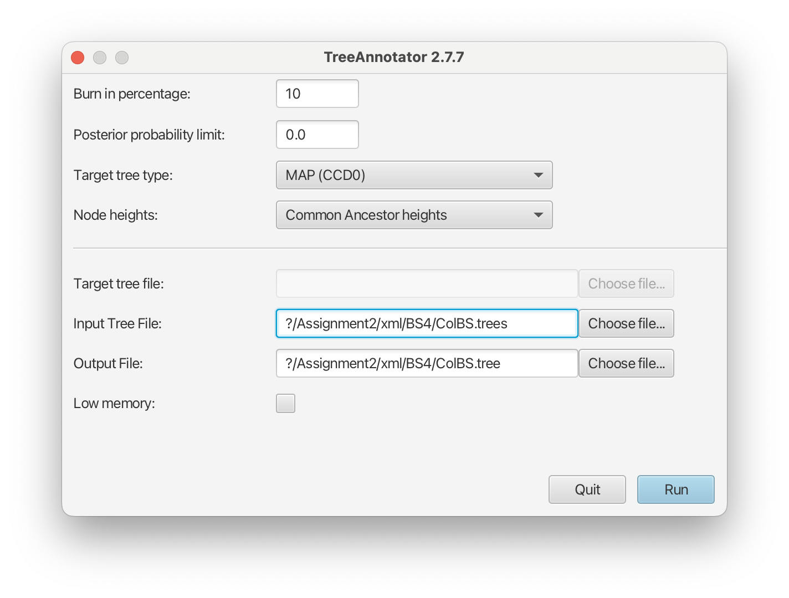

---
output:
  html_document: default
  pdf_document: default
editor_options: 
  markdown: 
    wrap: sentence
---

# BioSci700 Assignment 2 (15 marks)

Due date: 5th April 2024

Your name (UPI)

## Instruction

Please rename the file and add your name and UPI into the file name, and then replace the author into your name in the header above, including UPI insider the bracket.

This is an [R Markdown](http://rmarkdown.rstudio.com), which further produces either a HTML or PDF file.

Please follow the provided instructions carefully to set up the analysis and answer all questions, which are numbered using Roman numerals, such as **Question i:**.
One point for each question, and one bonus point for **clarity** and producing a well-written report.

Your responses to questions should be compiled into a data analysis report format.
Ensure that no answer blocks are overlooked, with the exception of the example provided below.
Substitute 'Your answer' with your actual response to each question, limiting your answers to a maximum of 150 words.
For questions that necessitate a screenshot, please ensure that the image is clear and legible.

**Answer starts:**

Your answer

**Answer ends**

Ensure you answer all questions and submit your report in either HTML or PDF format, which can be generated from this markdown file.
Before submitting, please verify that your report opens and displays correctly.

Additionally, it's beneficial to include all relevant figures in your answers, along with the log files and tree files associated with your analysis (excluding the BEAST 2 posterior tree sets due to their large file sizes).

For example:

- iqtree's tree file (e.g., "RSV2.nex.treefile") and log file (e.g., "RSV2.nex.log");
- BEAST 2 XML file (e.g., "RSV2.xml");
- BEAST 2 log file (e.g., "RSV2.log");
- BEAST 2 MCC tree file (e.g., "RSV2-tree-mcc.tree"), containing a single tree.

To minimize the size of your submission, consider compressing the files, ensuring to use only the ZIP format for compatibility. 

## Required software

Please ensure that the following software packages are installed and ready to use on your computer:

-   [iqtree2](http://www.iqtree.org/#download)
-   [TempEst 1.5.3](http://tree.bio.ed.ac.uk/software/tempest/)
-   [BEAST 2.7.6](http://www.beast2.org)
-   [Tracer 1.7.2](https://github.com/beast-dev/tracer/releases)
-   To visualize the tree, you may use [FigTree 1.4.4](http://tree.bio.ed.ac.uk/software/figtree/) or [icytree](https://icytree.org) if you prefer a software with a GUI, or [ggtree](https://bioconductor.org/packages/release/bioc/html/ggtree.html) if you prefer R.

## Data and methods

Please download the [alignment](./RSV2.nex) of phylodynamics of the Respiratory syncytial virus subgroup A (RSV-A).
RSV infects the human lower respiratory tract, causing symptoms that are often indistinguishable from the common cold.

The alignment consists of 129 molecular sequences coding for RSV-A’s G protein ([Zlateva et al 2004](https://doi.org/10.1128/jvi.78.9.4675-4683.2004)), a glycoprotein that allows the virus to attach itself to the host cells’ membranes.

We will conduct two analyses - one employing the maximum likelihood method, and the second using Bayesian phylogenetic inference to uncover the temporal signal within the provided alignment.

## 1. Maximum likelihood tree (2 points)

Run [iqtree2](http://www.iqtree.org/#download) on the dataset to construct a maximum likelihood tree, using the command `iqtree -s RSV2.nex`.
Please attach the maximum likelihood tree file (e.g., "RSV2.nex.treefile") and iqtree log file (e.g., "RSV2.nex.log") with the report.

For further support, please refer to the online documentation and tutorials of iqtree2.

### 1.1 Identify the "best-fit" model

Iqtree2 offers a wide range of DNA substitution models.
Upon execution, it leverages ModelFinder to identify the optimal model for your data, subsequently building the tree using this model.

 

**Question i:** By referring to the iqtree log file (e.g., "RSV2.nex.log"), what was the "best-fit" substitution model? What was its log-likelihood?
Please provide a brief, yet precise, description of the selected model.

**Answer starts:**

Your answer

**Answer ends**

### 1.2 Results

**Question ii:** Plot the maximum likelihood tree.
What are the units of branch length in this maximum likelihood tree?

**Answer starts:**

Your answer

**Answer ends**

## 2. Investigate temporal signal (4 points)

We will now employ [TempEst](http://tree.bio.ed.ac.uk/software/tempest/) to analyse the temporal signal and 'clock-likeness' of the maximum likelihood tree generated by iqtree2.
TempEst is specially designed for analysing trees that have not been inferred under a molecular-clock assumption to see how valid this assumption may be.
Additionally, it identifies the optimal root of the tree at the position that is likely to be the most compatible with the assumption of the molecular clock.

If you are unsure how to answer the following questions, please refer to the article by [Rambaut et al 2016](https://doi.org/10.1093/ve/vew007).

Launch TempEst and import the maximum likelihood tree file.
Record and familiarize yourself with the statistics displayed in the top left conner of the interface.

Then, select "Parse Date" and replicate the settings shown in the following image to extract years from taxon labels.

{width="500px"}

 

Navigate to the "Tree" tab to view the visualized tree, and proceed to the "Root-to-tip" tab to understand the implications of the regression analysis results

Next, activate the "best-fitting root" option in the top-left corner to root the tree at the position most congruent with the molecular clock hypothesis, utilizing the default "heuristic residual mean squared" function.

Report the differences between two trees according to the guidelines provided below.

### 2.1. Statistical results

Record both statistical results before and after ticking the "best-fitting root" option by text.
Pick up two statistic from them, which you think they are the matter of the most.
Explain their implications, and compare them with the analysis each other.

 

**Question i:**

-   Record the statistical outcomes both prior to and subsequent to activating the 'best-fitting root' option by text.
-   Explain the implications of two key statistics, "Slope (rate)" and "X-Intercept (TMRCA)",
-   Compare their impact on the analysis before and after the application of the 'best-fitting' model.

**Answer starts:**

Your answer

**Answer ends**

### 2.2. The "best-fitting root" tree

After activating the "best-fitting root" option, navigate to the "Tree" tab.

 

**Question ii:**

-   Provide a screenshot of the "best-fitting root" tree.
-   Briefly (in a few sentences) describe the benefits for analysing this dataset using the "best-fitting root" option comparing with the maximum likelihood method.

**Answer starts:**

Your answer

**Answer ends**

 

**Question iii:**

-   Look at both the "best-fitting root" tree and the root-to-tip plot, identify at least two problematic clades or taxa in the tree
-   Explain the indication of the problem by considering its position in the root-to-tip plot.

**Answer starts:**

Your answer

**Answer ends**

### 2.3. Exploring temporal signal

As [Rambaut et al 2016](https://doi.org/10.1093/ve/vew007) demonstrated, regression of root-to-tip genetic distance against sampling time can be used as a simple diagnostic tool for molecular clock models.

Keep the same option in TempEst, navigate to the "Root-to-tip" tab, and answer the following questions.

 

**Question iv:**

-   Does this dataset contain enough temporal signal to apply a molecular clock model. Why or why not?
-   Which type of molecular clock model would fit in to this dataset better, if yes for the above answer.

Use the number and figure to support your conclusion.

**Answer starts:**

Your answer

**Answer ends**

## 3. BEAST 2 analysis (9 points)

In this section, we will estimate the evolutionary rate from alignments containing sequences isolated at various times (heterochronous or time-stamped data) using BEAST 2.
BEAST 2 is a comprehensive tool for Bayesian phylogenetic analysis of molecular sequences across different platforms.
It uses Markov chain Monte Carlo (MCMC) to average over tree space, so that each tree is sampled proportionally to its posterior probability.

### 3.1. Set up the model through BEAUti

Launch BEAUti, set up the analysis following these steps:

- Import the "RSV2.nex" file into BEAUti, by navigating to the "File" menu and select "Import Alignment."

Upon selecting the file, the "Partitions" panel will display a single partition showing the number of taxa and sites in the alignment.
To examine the alignment more closely, double-click the partition to open the alignment viewer.

The gene in the dataset encodes a protein, which means its sequence is composed of triplets, or codons, each translating into an amino acid.
Crucially, it's established that different codon positions evolve at varying rates due to the structure of the 'genetic code' (Read [Bofkin & Goldman 2007](https://doi.org/10.1093/molbev/msl178) for details).
By incorporating this knowledge into the anaysis, we will divide the alignment into three partitions that correspond to each codon position, thereby accounting for the varied evolutionary rates across these positions.

-   To achieve this, click the "Split" button at the bottom of the "Partitions" panel, and then select the "1 + 2 + 3 frame 3" from the drop-down menu.

{width="300px"}

 

This action is based on our gene sequence beginning with its first complete codon at the third nucleotide of the alignment.
As a result, this process generates three distinct rows in the partitions panel, each representing one of the three codon positions.

-   Then, select all three partitions in the "Partitions" panel, and click the buttons "Link Clock Models" and "Link Trees". Rename the linked clock model to "clock" and tree model to "tree"by double-clicking their respective labels for editing.

{width="500px"}

 

**Question i:** For this analysis, please elucidate the rationale behind assigning distinct substitution models to each partition, and clarify the implications of linking clock models and trees from a phylogenetic perspective.

**Answer starts:**

Your answer

**Answer ends**

 

-   Next, select the "Tip Dates" tab and check the "Use tip dates" box. Since the data consists of viruses sampled at different years, keep the default setting "Since some time in the past". Click the "Auto-config" button and choose "after last" as the option for parsing the year information from the taxa names. Replace underscores `_` with `s`, select "Add fixed value to 1900", and click "OK".

{width="400px"}

 

This action will extract the years from the taxa names and append them to the "Date (raw value)" column in the table.
Verify if these years are accurately parsed.

{width="500px"}

 

-   Proceed to the "Site Model" tab, where you'll select the HKY model with 4 Gamma categories. Estimate the substitution rate, Gamma shape parameter, kappa, and frequencies for the stationary distribution by ticking the "estimate" checkbox.

{width="500px"}

 

You may notice an orange warning dot at the bottom of the panel initially.
However, after setting all three substitution rates to estimate, the warning will disappear, and the option to "fix mean mutation rate" will be triggered.

To streamline this process, utilize the "Clone" function to replicate the configuration.
Hold the `shift` key to select all site models on the left side, then click "OK" to clone the settings from a selected site model (the first one).
Afterwards, review each site model to ensure their configurations are identical.

The primary goal here is to configure the analysis to estimate the relative substitution rates of codons, which are relative to a general rate defined in the molecular clock model.

 

**Question ii:** Considering the principles of phylogenetics and insights gleaned from the previous TempEst analysis, please explain why we can estimate substitution rates in this case.

**Answer starts:**

Your answer

**Answer ends**

 

-   In the "Clock Model" tab, keep the default "Strict Clock" but set the molecular clock rate to a better starting value `0.001`.

 

**Question iii:**

-   Briefly explain what is the molecular clock model,
-   and what is the difference between the strict molecular clock model and the relaxed molecular clock model ([Drummond et al., 2006](https://doi.org/10.1371/journal.pbio.0040088)) in the phylogenetics?

**Answer starts:**

Your answer

**Answer ends**

 

-   To set up the priors, select the "Priors" tab.
    We are going to choose a simple tree prior for this analysis, so select "Coalescent Constant Population".

-   For our molecular clock model, we will set the prior on the "clockRate" parameter to a log-normal distribution with mean of `-5`, and standard deviation of `1.25` (M=-5 and S=1.25).
    The plot of this prior distribution and its quantiles can be visualised on the right side.

-   To configure the priors, navigate to the "Priors" tab.
    For this analysis, opt for a straightforward tree prior by choosing "Coalescent Constant Population."

-   In setting up our molecular clock model, assign a log-normal distribution as the prior for the "clockRate" parameter, specifying a mean of `-5` and a standard deviation of `1.25` (M=-5, S=1.25).
    You can examine the shape and quantiles of this distribution in the visual plot on the right.

{width="600px"}

 

-   Select the MCMC tab, adjust the "Chain Length" to `20000000` (20 million), establishing the total number of iterations for the Markov chain.
    For the "tracelog" and "treelog", set the "Log Every" to `10000` (10 thousand).
    This logging frequency ensures both trace and tree log files are synchronized, capturing 2000 samples each for subsequent analysis.
    Modify the "screenlog" setting, by changing the "Log Every" to `100000` (100 thousand).
    This adjustment will minimize the volume of outputs displayed on the screen.

-   After implementing these adjustments, proceed to save your configuration by exporting it as an XML file, e.g.
    RSV2.xml, by clicking "Save" in the "File" menu.

### 3.2. Run MCMC using BEAST

To analyse the results, run the BEAST 2 XML file **twice** with **different seeds**, and output files in separate sub-directories to avoid overwriting.
We recommend you create two sub-folders "beast-run1" and "beast-run2", then run the XML from each sub-folder (e.g. beast-run1).
This will use the folder as a working directory and output all files there.

Launch "BEAST", choose your XML, and click "Run".
Then, it will start a new run.
If you want to continue your previous BEAST 2 run, you need to change the drop-down list into "resume: appends log to the existing files (if any)".
Remember to check the seed in each screen output, making sure they are different between two runs.

{width="300px"}

 

Alternatively, you can run it from the command line `YOUR_PATH/bin/beast -beagle_SSE ../RSV2.xml`.
It is optional to use [BEAGLE](https://beagle-dev.github.io).
If you do not have it installed, you can remove `-beagle_SSE`, which would not affect the result.
For resuming, use the command `YOUR_PATH/bin/beast -beagle_SSE -resume ../RSV2.xml`.

### 3.3. Check the convergence

For this analysis, BEAST 2 produces two types of output files:

1.  A log file, which records the sampled values of all estimated parameters throughout the MCMC process.
2.  A tree file, which records the phylogenetic trees sampled during the MCMC.

To assess the convergence of the MCMC runs, indicating that the phylogenetic MCMC calculation has reached equilibrium, we utilize "Tracer." Open Tracer, then import the two BEAST log files, named "RSV2.log," by dragging and dropping them into the left-side panel sequentially.

One approach is to compute ESS, which Tracer has done for you.
In addition, you can navigate to the “Trace” tab in the upper-right corner, to the visualisation of the sampled values against the step in the MCMC chain.
It will help you see if the chain is mixing well and to what extent the samples are correlated.

The another approach is to make cross-chain comparisons by running multiple independently initialized chains.
Tracer offers simple visualisation to view the statistics and traces from multiple files.
In the "Trace Files" table, hold the `shift` and click to select both log files.
Please do not select the combined trace.
Then, single-click each parameter, you can see the combined plots, such as statistics and traces.

 

**Question iv:**

-   Determine if both of your MCMC runs have converged by considering specific criteria.
-   Please outline your criteria for convergence and explain how the results align with these standards. While including screenshots can strengthen your answer, please limit them to a maximum of two.

**Answer starts:**

Your answer

**Answer ends**

### 3.4. Analyse paramters and visualise traces

After the MCMC runs have converged, we are ready to present the results.
Given the simplicity of our dataset, we will proceed with the analysis using a single log file.

In the "Trace Files" table, click once on the first log file to select it.
Then, using the `shift` key, select the three "mutationRate" parameters simultaneously.
Navigate to the "Marginal Density" tab, and position the legend in the "Top-Right" corner.

{width="600px"}

 

**Question v:**

-   Report the mean, standard deviation, and 95% Highest Posterior Density (HPD) interval for the three relative substitution rates. Subsequently, show your process for calculating their absolute rates and disclose these values. Additionally, report the statistics for any parameters integral to this calculation.
-   Furthermore, clarify the unit of these substitution rates.

**Answer starts:**

Your answer

**Answer ends**

 

**Question vi:**

-   Identify which codon position exhibits the highest substitution rate and which shows the lowest, based on the mapped substitution rates to each codon position.
-   Employ fundamental biological concepts to elucidate the rationale behind the variation in substitution rates across different codon positions, and assess if the observed results align with theoretical expectations.

**Answer starts:**

Your answer

**Answer ends**

### 3.5. Analyse and visualise trees

We will use the program "TreeAnnotator" to summarise a maximum clade credibility (MCC) tree from a posterior tree set (logged in the tree file).
TreeAnnotator is an application that comes with BEAST.
First of all, we keep the burn-in percentage to 10(%), and the target tree type to "Maximum clade credibility tree".
Then we select the "Node heights" to "Median heights", and provide input and output file names.
This will rescale the node height to reflect the posterior median node heights for the clades contained in the MCC tree.
More details about settings are available from [here](https://www.beast2.org/treeannotator/).

{width="350px"}

 

The visualization tools like "FigTree" can be used to visualize the MCC (Maximum Clade Credibility) tree, where some meta-data has been annotated by TreeAnnotator.

Navigate to the "Trees" section in the left panel and enable the "Order nodes" check-box.
This will organize the tips alphabetically or numerically by their labels.
Proceed to the "Node Labels" section, expand it, and use the "Display:" drop-down list to select the specific statistics you wish to show on the tree nodes for a comprehensive post-analysis.

Here is the screenshot for FigTree plotting the HPD interval of the time of MRCA at each internal node:

{width="600px"}

 

**Question vii:**

-   What is the estimated age of the most recent common ancestor (MRCA) for all samples, also known as root age, and what is the associated 95% HPD interval for this estimate?
-   How is the 95% HPD interval of the root age interpreted?
-   Find the equivalent parameter displayed in Tracer, and provide its name.
-   Translate the mean of root age into the year and month format, and provide a detailed explanation of your conversion process.

**Answer starts:**

Your answer

**Answer ends**

 

Refer to the original publication [Zlateva et al 2004](https://doi.org/10.1128/jvi.78.9.4675-4683.2004) that provides the dataset context.
Your next task involves analysing the MCC tree to identify clades corresponding to the five primary subgroups detailed in the study: GA1, GA2, GA4, GA5, and BE/A1, as depicted in Figure 1 of the publication.
Please **exclude** the three sequences labelled USALongs56, AUSA2s61, and S2s76 from your clade selections as these are considered as outgroup sequences for this analysis.

 

**Question viii:**

-   Take a screenshot of your MCC tree (or plot it using R), save it to an image file, and then provide the figure as these five clades marked and labelled.
-   What is the unit of branch lengths in the summarised MCC tree?

**Answer starts:**

Your answer

**Answer ends**

 

**Question ix:**

-   Report the time and 95% HPD interval of each MRCA for the five subgroups in a concise and clear format, including their means that have been converted into years and months.
-   Discuss the estimated root age, MRCA times for the five subgroups, the average substitution rate across all sites, and their 95% HPD intervals in the context of RSV's evolutionary history. The discussion should illustrate how these subgroups diverged over time.

**Answer starts:**

Your answer

**Answer ends**
