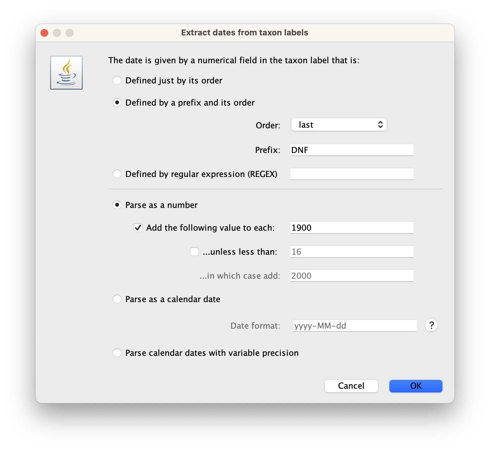
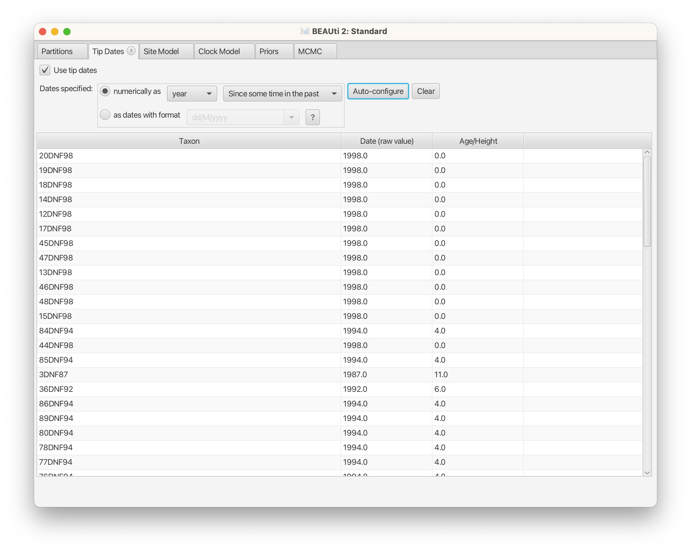
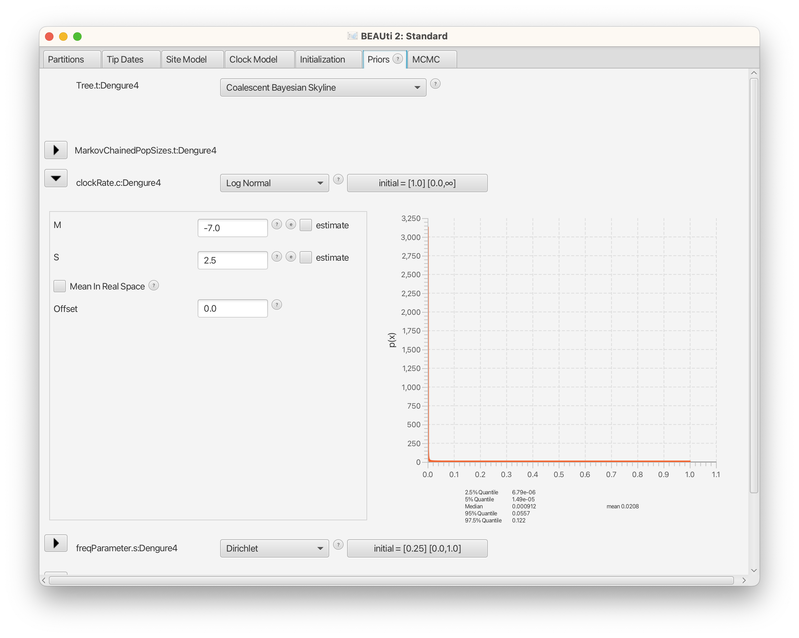
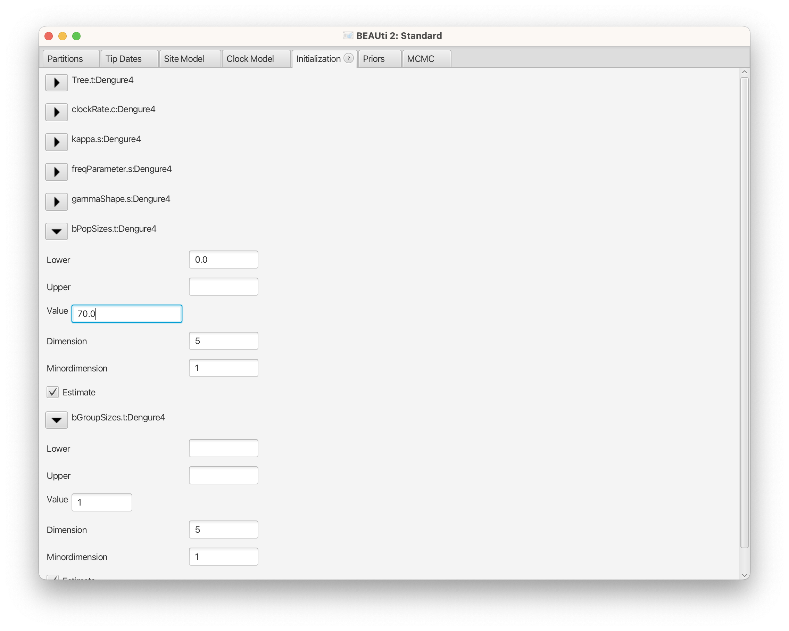
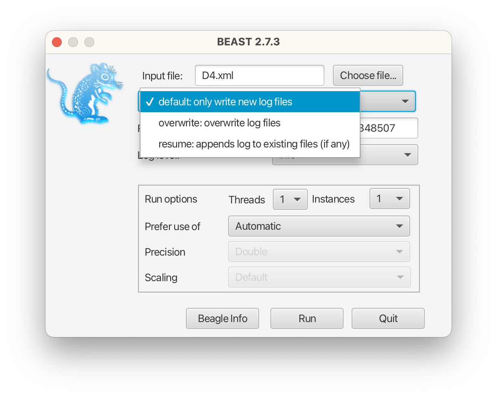

# BioSci700 Assignment 2 (15 marks)

Your name (UPI)

## Software and Data

Please ensure that the following software packages are installed and ready to use on your computer:

- [iqtree2](http://www.iqtree.org/#download)
- [BEAST 2.7.3](http://www.beast2.org)
- [TempEst 1.5.3](http://tree.bio.ed.ac.uk/software/tempest/)
- [FigTree 1.4.4](http://tree.bio.ed.ac.uk/software/figtree/) or [ggtree](https://bioconductor.org/packages/release/bioc/html/ggtree.html) or [icytree](https://icytree.org)
- [Tracer 1.7.2](https://github.com/beast-dev/tracer/releases)

To perform the analysis, download the alignment of [Dengue virus data](./Dengue4.nex), published by [Bennett et al. (2010)](https://doi.org/10.1093/molbev/msp285), which consists of 76 samples of DENV-4 sequences between 1981 and 1998. Read the publication and follow the instructions below. Submit the report and required figures, along with the related files and outputs.

## 1. Maximum likelihood tree (2 points)

Create a maximum likelihood tree of the dataset using [iqtree2](http://www.iqtree.org/#download).

**1.1. What is the “best-fit” model chosen for this data according to iqtree's report? What criterion is used for choosing this “best-fit” model?**

**1.2. Plot the maximum likelihood tree. What is the unit of branch lengths in your maximum likelihood tree?**

You may use [FigTree](http://tree.bio.ed.ac.uk/software/figtree/) or [icytree](https://icytree.org) if you prefer a software with a GUI, or [ggtree](https://bioconductor.org/packages/release/bioc/html/ggtree.html) if you prefer R.

Attach the maximum likelihood tree file (e.g., “Dengue4.nex.treefile”) and iqtree log file (e.g., “Dengue4.nex.log”) with the report.

## 2. Investigate temporal signal (5 points)

Use [TempEst](http://tree.bio.ed.ac.uk/software/tempest/) to investigate the temporal signal in the maximum likelihood tree. Click “Parse Date”, change “Order” to `last`, and set “Prefix” to `DNF`. Select the checkbox “Add the following value to each:”, and click “OK” to parse years from taxon labels into dates. Switch to the “Tree” tab to check the visualized tree.

{width=300px}

Select the checkbox “best-fitting root” in the top-left corner to root the tree at the position that is most compatible with the assumption of the molecular clock, using the `heuristic residual mean squared` function (as default). Report the differences between the original maximum likelihood tree and the best-fitting root tree by following the requirements below:

**2.1. Record the statistical results for both trees, the original maximum likelihood tree, and the best-fitting root tree. Explain the implications of these statistical results.**

**2.2. Take a screenshot of the best-fitting root tree in the “Tree” tab (you should have already plotted the original tree in the previous section). Ensure that the tip labels are visible. Describe which tree looks more reasonable in terms of the sampling dates and why.**

**2.3. Take screenshots of two root-to-tips plots from both trees. Describe which plot is more reasonable and why.**

## 3. BEAST analysis (8 points)

In this section, we will use the Coalescent Bayesian Skyline plot [Drummond, Rambaut, Shapiro, & Pybus, 2005](https://academic.oup.com/mbe/article/22/5/1185/1066885) to study the phylodynamics of DENV-4. Answer all questions numbered by Roman numerals.

### 3.1. Set up the model through BEAUti and run MCMC using BEAST.

To prepare the data for analysis, follow these steps in BEAUti:

- Import the "Dengue4.nex" file into BEAUti, navigate to the "File" menu and select "Import Alignment." Once the file is selected, you will notice that there is a single partition available in the "Partitions" panel, which provides information on the number of taxa and sites in the alignment. To view the alignment, simply double-click on the partition to launch the viewer.

- Select the "Tip Dates" tab and check the "Use tip dates" box. Since the data consists of viruses sampled at different years, keep the default setting "Since some time in the past".
Click the "Auto-config" button and choose "after first" as the option for parsing the year information from the taxa names. Replace underscores `_` with `F` and click "OK". This will parse the years from the taxa names and add them to the "Date (raw value)" column in the table.

{width=600px}

- In the "Site Model" tab, choose the HKY model with 4 Gamma categories. Estimate the substitution rate, Gamma shape parameter, kappa, and frequencies for the stationary distribution.

{width=600px}

- In the "Clock Model" tab, select the default "Strict Clock" and set the starting value of the molecular clock rate to `0.001`.

- Under the "Priors" tab, select the "Coalescent Bayesian Skyline" tree prior. Change the "clockRate" prior from Uniform to Log Normal. Set `M` to `-7` and `S` to `2.5`. You can use the R code `qlnorm(p=c(0.025,0.5,0.975), meanlog=-7, sdlog=2.5)` to display the quantiles.

{width=600px}

**i. Explain why Uniform is the "bad" prior to estimate the molecular clock rate? Why Normal prior is also an improper prior here?**

- To show the initialization panel, go to the "View" menu and select "Show initialization panel". Then, expend the "bPopSizes" settings by clicking on the black triangle icon. Change the starting "Value" to `70`.

{width=600px}

- Under the MCMC tab, set the "Chain Length" to `25000000` (25 million). For the "tracelog", change the "Log Every" to `5000`, and do the same for the "treelog". It is recommended to use the same logging frequency for both the trace log and tree log files, as they will be used for further analysis. For the "screenlog", you can set the "Log Every" to `100000` to reduce the frequency of output printed to the screen.

- Once you have made these changes, save the setup as an XML file (e.g. D4.xml) by clicking "Save" in the "File" menu. 

**ii. Describe what models you have applied for this analysis.** 

You can use a proper natural language to reduce the content, such as "set the clock rate prior to LogNormal(m=-7,s=2.5)" (Note: priors are the part of the model)

### 3.2. Analyse results

Open "BEAST", choose your XML, and click "Run". Then, it will start a new run. If you want to continue your previous BEAST 2 run, you need to change the drop-down list into "resume: appends log to the existing files (if any)".

{width=300px}

To analyze the results, run the BEAST 2 XML file **twice** with different seeds, and output files in separate sub-directories to avoid overwriting. Summarize the results in the report, including relevant graphs and figures. Check the convergence of your runs using "Tracer" and run the analysis for longer if needed.

**iii. Please report the important parameters of your analysis and explain how you can determine if the MCMC chains have run for long enough. Additionally, discuss the advantages of running MCMC chains multiple times with different seeds compared to just one run.**

To summarize the sampled trees, use "TreeAnnotator" to generate a maximum clade credibility tree and visualize it in "FigTree" or "IcyTree". Compare this approach with using "Densitree", and answer:

**iv. What are the strengths and weaknesses of the two summary methods for this analysis?**

Look at the maximum clade credibility tree:

**v. What unit are the branch lengths measured in the maximum clade credibility tree? What is the estimated age of the most recent common ancestor for all samples, and what is the corresponding highest posterior density (HPD) interval? How can this age be interpreted in the context of the Dengue virus epidemic?**

To reconstruct and plot the past population dynamics, open "Tracer" and navigate to "Analysis" => "Bayesian Skyline Reconstruction". To ensure that the analysis uses the correct dates, specify the "Age of the youngest tip" as the time when the most recent sample was collected. Once this is done, click "OK" to begin the analysis.

**vi.What is the effective population size (Ne) estimated from the Bayesian Skyline Reconstruction analysis? Present the skyline plot and examine if any population dynamics can be observed over time.**

### 3.3. Increasing the dimesion of effective population sizes

To improve the skyline plot, one simple method is to increase the dimension of effective population sizes.

To do this, launch "BEAUti" and load your XML file (e.g., D4.xml) by selecting "File" from the menu bar and clicking "Load". Ensure that all previous settings are correct. Next, select the "Initialization" panel and change the "Dimension" of both "bPopSizes" and "bGroupSizes" from the default value of `5` to `10`.

Save the modified settings into a new XML file (e.g., D4pop10.xml), create a new directory, and run it using BEAST2. This time, you can run the analysis once.

Once the analysis is completed, use "Tracer" to obtain the skyline plot.

Repeat the process with a dimension of `20` for both "popSizes" and "groupSizes". After running this analysis, obtain the skyline plot using "Tracer".

**vii. Compare the three skyline plots, and answer the following questions.**

How can the dimension for the Bayesian skyline analysis be chosen effectively? What role does the number of groups play in the analysis? In what ways does altering the dimension impact the dynamics of effective population sizes?

The three skyline plots must be provided in your report.

**viii. Select the best plot and draw your conclusion on the Bayesian skyline analysis of DENV-4 data.**

### Bonus question: 

**Plot 3 skyline plots in a single graph using R "ggplot2". Explain if there are any systematic differences between the plots.**

