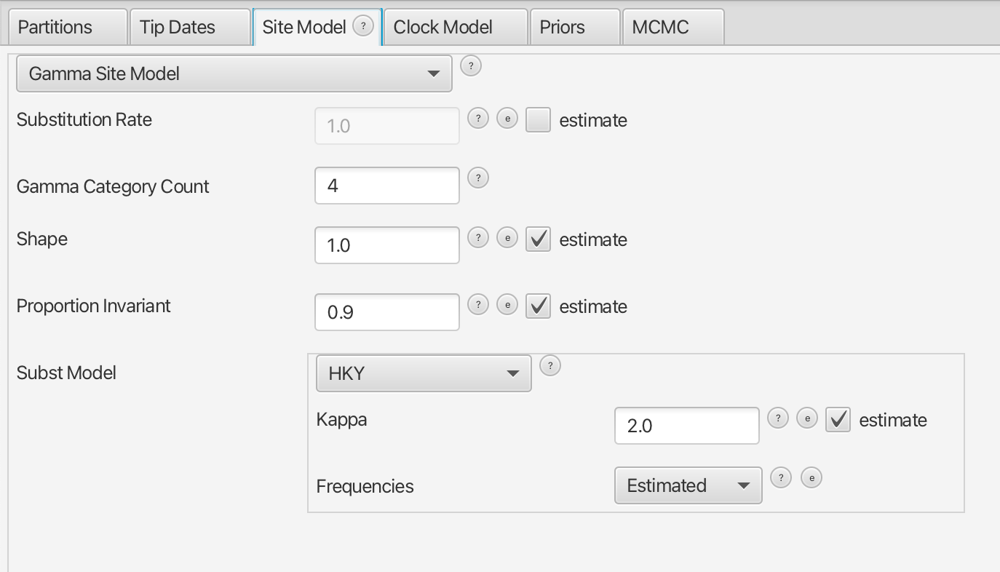

## Assignment2 : Probabilistic Model and Bayesian Phylogenetic inference (25 marks)

Due date: 11th April 2025

Your name (UPI)

## Instructions for report submission

  1. Report Format & Template Usage

Write your report using this template and save it as a PDF file. You may use
[Overleaf](https://www.overleaf.com), MS Word, or Google Docs, and then export the final report as a
PDF. The PDF file name must include your name and UPI for identification.

{:start="2"} 
  2. Completing the Report

Update the author section in the template with your name and UPI in the header. Copy all section and
subsection titles from the template, along with the questions, and then provide your answers
accordingly. Avoid copying the instructions to minimize the number of pages. Follow all instructions
carefully to ensure proper setup and accurate responses from software tools. The questions are
numbered in Roman numerals (e.g., **Question i:**). Please remove the asterisks and adjust the font
size to a more suitable one when copying the markdown template.

{:start="3"}
  3. Answering Questions

Your responses should be written inside the designated answer blocks. Ensure that no answer blocks
are left blank, except for the example provided in the template. Replace Your answer with your
actual response, limiting each answer to a maximum of 100 words. For questions requiring
screenshots, ensure all images are clear and legible.

Example format:

**Answer starts:**

Your answer

**Answer ends**

{:start="4"} 
  4. Finalising & Submitting Your Report

Ensure all questions are answered and that your report is in PDF format. Verify that your report
opens correctly before submission. Include all relevant figures, along with necessary log and tree
files, such as BEAST log file *.log, summary tree file *.tree, and tree file *.trees (if not huge).

{:start="5"}
  5. File Compression & Naming (optional)

To reduce submission size, compress all your files and sub-folders using the ZIP format only. The
ZIP file must be named with your name and UPI for easy identification. Before submitting, ensure
that the ZIP file can be extracted properly.

By following these instructions, you will ensure a clear, well-organized, and properly formatted
submission.

There are 23 points for all questions, and 2 points for **clarity** and a **well-structured**
report.

## Project description

In this tutorial, we will analyse the subsampled data to estimate the dynamics of SARS-CoV-2
outbreak in New Zealand. To maximize your lab time, please install all [required
software](https://walterxie.github.io/BioSci700/) in advance.

Objectives:

- Understand how to infer population dynamics from genetic data using a Coalescent Bayesian Skyline.

- Learn how to set up and perform a Skyline analysis effectively.

- Practice interpreting the results of a Skyline analysis.

### Data

Please download the prepared [alignment](./data/cov100.alg.fa), which are randomly subsampled from a
large Delta SARS-CoV-2 outbreak in Aotearoa New Zealand ([Jelley et al.
2022](https://www.nature.com/articles/s41467-022-31784-5)). The alignment consists of 100 SARS-CoV-2
sequences from infected patients, and the file [Date.txt](./data/Date.txt) contains the collection
dates.

## Coalescent Bayesian Skyline analysis 

In this section, we will look at a popular coalescent method, the Coalescent Bayesian Skyline
[(Drummond, Rambaut, Shapiro, & Pybus, 2005)](https://doi.org/10.1093/molbev/msi103).

### 1. Understanding the data (2 points)

"Garbage in, garbage out." Before conducting phylogenetic analysis, it is essential to carefully
examine the sequence alignment. This information will help you set up the analysis correctly.

**Question i (1 point):** List at least two key measurements related to the alignment (excluding
duplicate sequences) that should be considered before performing phylogenetic analysis. Report these
measurements for this dataset.

**Answer starts:**

Your answer

**Answer ends**

Sometimes, an alignment may contain duplicate sequences, even if they were sampled from different
individuals. Identifying and addressing these duplicates is important for accurate phylogenetic
inference.

**Question ii (1 point):** For a coalescent model, should duplicate sequences be kept or removed?
Explain your reasoning. Additionally, describe a simple method to detect duplicate sequences, 
and report at least one in this alignment.

**Answer starts:**

Your answer

**Answer ends**

### 2. Understanding the model (4 points)

Refer to the paper [(Drummond, Rambaut, Shapiro, & Pybus,
2005)](https://doi.org/10.1093/molbev/msi103) and go through and comprehend the two skyline plots in
Figure 1.

**Question iii (2 point):** In your own words, briefly and precisely explain the Generalized Skyline Model and its key parameters. (Do not copy from the paper)

**Answer starts:**

Your answer

**Answer ends**

**Question iv (2 point):** Compared to models that assume a single function for effective population size (e.g., the constant-sized coalescent model or the exponential growth model), is the skyline model more suitable for studying viral phylodynamics? Explain why.

**Answer starts:**

Your answer

**Answer ends**

### 3. Setting up the analysis in BEAUti (6 points)

Follow these steps to prepare the data for analysis in BEAUti:

1. Import the alignment file

	- Open BEAUti. 
	
	- Navigate to File → Import Alignment and select "cov100.alg.fa". 
	
	- The alignment will appear in the Partitions panel, showing the number of taxa and sites. 
	
	- To inspect the alignment, double-click on the partition to launch the viewer.

In virus phylogenetic studies, the sampling dates for the virus sequences are typically known. 
Each viral sample corresponds to a specific date when it was collected.
These dates naturally provide a temporal direction from the root to the tips, so called "forward time".

2. Configure Tip Dates

	- Go to the Tip Dates tab and check "Use tip dates." 
	
	- Since the dataset consists of viruses sampled at different years, keep the default setting: "Since some time in the past." 
	
	- Click "Auto-config", select "Read from file", then click "Browse" to load the prepared mapping file. 
	
	- Change the file type option to "txt", then click OK. 
	
	- This will extract the dates from the second column of the file and populate the "Date (raw value)" column in the table.

3. Ensure Proper Date Formatting

	- The raw age values may not make sense because the dates are stored in a non-numeric format. 
	
	- To correct this, select "As dates with format" and verify the ages again.

The final configuration should match the screenshot provided below:

<figure class="image">
 
 <figcaption>Fig 1: Tip Dates</figcaption>
</figure>

**Question v (2 point):** What is the significance of assigning dates to the tips of a phylogenetic tree for this analysis, 
and how does this transformation affect the interpretation of branch lengths, including the units of length?

**Answer starts:**

Your answer

**Answer ends**

4. Configure the site model

	- Navigate to the "Site Model" tab. 
	
	- Select the HKY model with 4 Gamma categories. 
	
	- Gamma shape parameter → Estimate - Proportion invariant → Estimate (set starting value to 0.9) 
	
	- Kappa (κ) → Estimate - Stationary distribution frequencies → Estimate

<figure class="image">
 
 <figcaption>Fig 2: Site Model</figcaption>
</figure>

**Question vi (1 point):** What is rate heterogeneity? What are the parameters to model the rate heterogeneity in this panel?

**Answer starts:**

Your answer

**Answer ends**

5. Configure the clock model

	- Navigate to the "Clock Model" tab. 
	
	- Keep the default "Strict Clock". 
	
	- Set the starting value of the molecular clock rate to 8E-4.

**Question vii (1 point):** What is the strict clock model? Why do we used it in this analysis?

**Answer starts:**

Your answer

**Answer ends**

6. Configure priors

	- Navigate to the "Priors" tab. 
	
	- Set the Tree Prior to Coalescent Bayesian Skyline. 
	
	- Change the clockRate prior from Uniform to Log Normal, set M to -7.1 and S to 1.25, where M is the mean in the log space. 
	
	- Observe the prior distribution and quantiles in the plot on the right side.

<figure class="image">
 
 <figcaption>Fig 3: Clock Rate prior</figcaption>
</figure>

**Question viii (2 point):** Why are both Uniform and Normal prior unsuitable for estimating the
molecular clock rate? What summary statistics should be used to determine the sampling range of a
prior? List them for this clock rate prior.

**Answer starts:**

Your answer

**Answer ends**

7. Adjust the starting value or dimension for "bPopSizes" and "bGroupSizes"

	- Open the Initialization Panel, by going to the "View" menu and select "Show initialization panel". 
	
	- Expand the "bPopSizes" settings by clicking the black triangle icon. 
	
	- Update the starting "Value" to 10, 
	
	- Keep "Dimension" as 4 (default), but adjust for future analyses if needed. 
	
	- Apply the same settings to "bGroupSizes".

8. Configure MCMC

	- Navigate to the MCMC tab. 
	
	- You may change the log file name and tree log file name. 
	
	- keep everthing else as the default.

Once you have made these changes, save the setup as an XML file (e.g. BS4.xml) by clicking "Save" in
the "File" menu.

### 4. Run BEAST and checking convergence (2 points)

1. Run BEAST:

	- Open "BEAST" and select your XML file. 
	
	- Click "Run" to start a new MCMC run. 
	
	- If you want to continue a previous BEAST 2 run, select "resume: appends log to the existing files (if any)" from the drop-down menu.

2. Checking convergence:

	- Since this XML file uses the default MCMC chain length, the run should complete quickly. 
	
	- Open another software "Tracer" to assess whether the MCMC run has converged.

**Question ix (1 point):** Please outline the criteria for determining MCMC convergence, and
evaluate whether this run has converged. If the run has not converged, suggest potential solutions
to improve the run to meet convergence criteria.

**Answer starts:**

Your answer

**Answer ends**

3. Long runs:

Navigate to the BEAUti MCMC tab. If you close it, you can use the "File" menu to "load" the XML.
Then, modify your MCMC settings to :

- Set the "Chain Length" to 30000000 (30 million), increase the length if necessary. 

- Trace Log ("tracelog") → Set "Log Every" to 10000. 

- Tree Log ("treelog") → Set "Log Every" to 10000 (same as tracelog for consistency). 

- Screen Log ("screenlog") → Set "Log Every" to 1000000 to reduce on-screen output.

**Note:** using the same logging frequency for both the trace log and tree log ensures consistency
in further analyses.

Save this to another XML file (e.g. BS4-long.xml), and then run it **twice** with different seeds,
and output files in separate sub-directories to avoid overwriting. Check the convergence of your
both runs using "Tracer" and run the analysis for longer if needed.

**Question x (1 point):**
Provide the screenshot of Tracer to prove both of your runs have converged using the criteria above (Max 2 figures).

**Answer starts:**

Your answer

**Answer ends**

### 5. Analysing the log and generating Skyline plot (2 points)

To streamline the lab process, we will now focus on one of your converged runs only. 

Open Tracer, 

**Question xi (1 point):** Provide the summary statistics for the key parameters in your analysis, and briefly explain their biological significance.

**Answer starts:**

Your answer

**Answer ends**

Navigate to Analysis → Bayesian Skyline Reconstruction, and open the tree log file.
To ensure accurate date estimates in the analysis, specify the "Age of the youngest tip."
In this case, the age is 2021.918.
Press OK to reconstruct the past population dynamics. 

<figure class="image">
 
 <figcaption>Fig 4: Skyline plot</figcaption>
</figure>

**Question xii (2 point):** 

- Attach the result of Skyline plot. 

- Explain why 2021.918 is used.

- Explain the meaning of the x and y axes.

- Briefly describe the key events or trends observed in the plot.

**Answer starts:**

Your answer

**Answer ends**

### 6. Summarising the posterior trees (2 points)

Because of how peculiar and discrete tree space is, it is a bit harder to summarize and visualize
the posterior distribution over phylogenetic trees. We will use a special tool for that, 
[TreeAnnotator](https://www.beast2.org/treeannotator/).

To summarize the trees logged during MCMC, we will use the CCD methods implemented in the program
TreeAnnotator to create the maximum a posteriori (MAP) tree. The implementation of the conditional
clade distribution (CCD) offers different parameterizations, such as CCD0, which is based on clade frequencies. 
The MAP tree topology represents the tree topology with the highest posterior probability, averaged over all branch lengths and substitution parameter values.

You need to install CCD package to make the options available in TreeAnnotator.

Please follow these steps after launching TreeAnnotator:

1. Set 10% as the burn-in percentage; 
2. Select “MAP (CCD0)” as the “Target tree type”; 
3. For “Node heights”, choose “Common Ancestor heights”; 
4. Load the tree log file that BEAST 2 generated (it will end in “.trees” by default) as “Input Tree File”, for example, ColBS.trees. If you select it from the file chooser, the parent path will automatically fill in.
5. Finally, for “Output File”, copy and paste the input file path but replace the ".trees" with ".tree". This will create the file containing the resulting MAP tree. 

The image below shows a screenshot of TreeAnnotator with the necessary settings to create the summary tree. 
"?" will be replaced to the corresponding path. 

<figure class="image"> 
  
 <figcaption>Fig 5: TreeAnnotator</figcaption> 
</figure>

**Question xiii (2 point):** 
What is the Maximum a Posteriori (MAP) tree in Bayesian phylogenetics, 
and does it always exist within the set of posterior sampled trees? 
Explain why or why not.

**Answer starts:**

Your answer

**Answer ends**

### 7. Visualising the MAP tree (3 points)

Summary trees can be viewed using FigTree and DensiTree, the latter being distributed with BEAST 2. 

Using FigTree, click the "File" menu and "Open...", then load TreeAnnotator’s output file as the input 
(if you were to load the entire tree log file, FigTree would show you each tree in the posterior individually).

Navigate to the "Trees" section in the left panel and enable the "Order nodes" check-box. This will
organize the tips alphabetically or numerically by their labels. Proceed to the "Node Labels"
section, expand it, and use the "Display:" drop-down list to respectively select the "height" and "height_95%_HPD".

You need to attached at least one image but no more than two figures to support your answers in this subsection. 

**Question xiv (2 points):**

-   What is the estimated age of the most recent common ancestor (MRCA) for all samples, also known as root age, and what is the associated 95% HPD interval for this estimate?

-   How is the 95% HPD interval of the root age interpreted?

**Answer starts:**

Your answer

**Answer ends**

**Question xv (1 points):**
Convert the mean root age into a specific date in the format (dd/M/yyyy), including the day, month (in English), and year. 
Provide a detailed explanation of the steps involved in your conversion process.

**Answer starts:**

Your answer

**Answer ends**

### 8. Report (2 points)

**Question xvi (< 150 words):**
Research the history of the Delta variant outbreak in New Zealand and write a brief report explaining how the virus was likely spread, 
based on your findings from this phylogenetic analysis.

**Answer starts:**

Your answer

**Answer ends**

