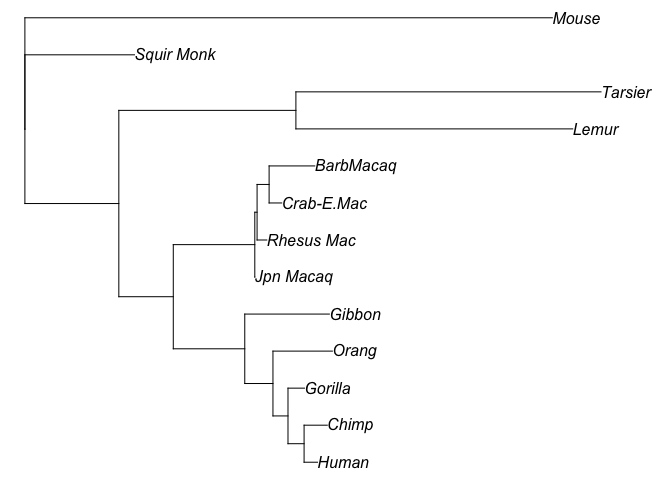

## Preparation

In this lab, we will learn how to use R to construct phylogenetic trees
using some basic algorithms, such as UPGMA and Neighbour-joining, etc.

Please download the nucleotide [alignment](ABCD.fasta), and save it into
your working directory. You can preview the alignment by using any text
editor to open the file.

We also need three R libraries: “ape”, “phangorn”, and “phytools”. If
your R has not got them, please use `install.packages` to install them.

## 1. Pairwise distances

Let’s load “ape” first into R:

    library(ape)

Make sure the the alignment file is in your working directory, then load
the alignment from the fasta file:

    # setwd("~/WorkSpace/BioSci700")
    alg = read.FASTA("ABCD.fasta")

This alignment has 4 taxa and 20 sites. The nucleotides were composited
to create the distance matrix in [Lecture
5](https://alexeidrummond.org/bayesian_phylo_lectures/lecture5/#/19).

Using the function `dist.dna` to compute the distribution of pairwise
distances, we can multiple it with the number of sites (20) to obtain
the matrix of pairwise distances.

    # 20 sites
    d = dist.dna(alg, model = "raw") * 20
    d

    ##    A  B  C
    ## B  8      
    ## C  7  9   
    ## D 12 14 13

**Question 1 :** what does this matrix tell us?

## 2. Algorithms

Secondly, we will use the library “phangorn” to create trees, and use
“phytools”.

    library(phangorn)
    library(phytools)

    ## Loading required package: maps

### 2.1 UPGMA

Now, please reuse the distance matrix `d` and compute the UPGMA tree.
Use `plot` function to draw the tree, and use `edgelabels` to show
branch lengths.

    treeUPGMA <- upgma(d)
    plot(treeUPGMA, use.edge.length=T, no.margin=TRUE)
    edgelabels(treeUPGMA$edge.length)

### 2.2 Neighbour-joining

Then compute the neighbour-joining tree. As it produces unrooted trees,
you need to add the “unrooted” argurment to the `plot` function.

    treeNJ <- NJ(d)
    plot(treeNJ, type="unrooted", use.edge.length=T, no.margin=TRUE)
    edgelabels(treeNJ$edge.length)

**Question 2 :** what is pros and cons of the neighbour-joining
algorithm?

### 2.3 Parsimony

To understand the parsimony method, we need a more complex example.
Please follow the instructions below, which are modified from the
“phangorn”
[tutorial](https://cran.r-project.org/web/packages/phangorn/vignettes/Trees.html).

First load the alignment “primates”, and remove the outgroup sequence
“Bovine” to make the analysis simple.

    fdir <- system.file("extdata/trees", package = "phangorn")
    primates <- read.phyDat(file.path(fdir, "primates.dna"), format = "interleaved")
    names(primates)

    ##  [1] "Mouse"      "Bovine"     "Lemur"      "Tarsier"    "Squir Monk"
    ##  [6] "Jpn Macaq"  "Rhesus Mac" "Crab-E.Mac" "BarbMacaq"  "Gibbon"    
    ## [11] "Orang"      "Gorilla"    "Chimp"      "Human"

    # rm "Bovine"
    primates <- primates[-2]
    names(primates)

    ##  [1] "Mouse"      "Lemur"      "Tarsier"    "Squir Monk" "Jpn Macaq" 
    ##  [6] "Rhesus Mac" "Crab-E.Mac" "BarbMacaq"  "Gibbon"     "Orang"     
    ## [11] "Gorilla"    "Chimp"      "Human"

We can now create the UPGMA and NJ tree respectively.

    dm  <- dist.ml(primates)
    treeUPGMA  <- upgma(dm)
    treeNJ  <- NJ(dm)

The UPGMA tree looks like:

    plot(treeUPGMA, no.margin=TRUE)

The NJ tree looks like:

    plot(treeNJ, type="unrooted", no.margin=TRUE)

Compare the parsimony score between two trees.

    parsimony(c(treeUPGMA, treeNJ), primates)

    ## [1] 676 676

We then can give a starting tree, and perform nearest-neighbor
interchanges (NNI) to find the maximum parsimony tree.

    treePars <- optim.parsimony(treeUPGMA, primates, rearrangements = "NNI")

In the end, plot the maximum parsimony tree.

    plot(treePars, type="unrooted", no.margin=TRUE)

**Question 3 :** assuming there are two trees giving different parsimony
scores, which tree should be the maximum parsimony tree? Why?

### 2.4 Maximum likelihood

The scripts below are using the maximum likelihood approach to estimate
the parameters from “primates” data, and eventually create a maximum
likelihood phylogenetic tree from the inference.

First we create a NJ tree using F81 model as the starting tree.

    dm <- dist.ml(primates, "F81")
    # NJ starting tree
    tree <- NJ(dm)

Then we define the model to HKY + Γ(4) and optimise the parameters.

    # HKY + Γ(4)
    fitStart <- pml(tree, primates, k=4)
    fitHKY <- optim.pml(fitStart, model="HKY", optGamma=TRUE, rearrangement="stochastic")

The result is:

    fitHKY

    ## 
    ##  loglikelihood: -2394.26 
    ## 
    ## unconstrained loglikelihood: -1230.335 
    ## Discrete gamma model
    ## Number of rate categories: 4 
    ## Shape parameter: 5.98472 
    ## 
    ## Rate matrix:
    ##         a       c       g       t
    ## a  0.0000  1.0000 27.0094  1.0000
    ## c  1.0000  0.0000  1.0000 27.0094
    ## g 27.0094  1.0000  0.0000  1.0000
    ## t  1.0000 27.0094  1.0000  0.0000
    ## 
    ## Base frequencies:  
    ## 0.4013194 0.3738494 0.04584645 0.1789847

Tips: you can use the command `str(fitHKY)` to list all available items
inside “fitHKY”.

As you can see, the tree from this result is unrooted. So we will use
the function `root` to assign the root to the tree given the outgroup
taxon “Mouse”.

    is.rooted(fitHKY$tree) 

    ## [1] FALSE

    rt <- root(fitHKY$tree, outgroup = "Mouse", resolve.root = TRUE)

Finally, the maximum likelihood tree looks like:

    plot(rt, use.edge.length=T, no.margin=TRUE)

Add the command `edgelabels(round(rt$edge.length, 2))` to show all
branch lengths.

### 2.5 Model selection

When you make a data analysis using the model-based approach, you need
to know which model fits the best for the given data.

So we compare different nucleotide substitution models for “primates”.

    mt = modelTest(primates)

    mt

    ##      Model df    logLik      AIC          AICw     AICc         AICcw      BIC
    ## 1       JC 23 -2818.438 5682.876 1.629324e-184 5688.184 1.660059e-183 5762.151
    ## 2     JC+I 24 -2815.792 5679.585 8.449229e-184 5685.382 6.739990e-183 5762.306
    ## 3     JC+G 24 -2818.237 5684.474 7.328651e-185 5690.271 5.846099e-184 5767.196
    ## 4   JC+G+I 25 -2815.826 5681.651 3.006045e-184 5687.962 1.854879e-183 5767.820
    ## 5      F81 26 -2683.168 5418.336 4.531240e-127 5425.185 2.136437e-126 5507.951
    ## 6    F81+I 27 -2677.850 5409.701 3.399091e-125 5417.112 1.209442e-124 5502.763
    ## 7    F81+G 27 -2680.515 5415.029 2.367447e-126 5422.441 8.423696e-126 5508.091
    ## 8  F81+G+I 28 -2677.767 5411.534 1.359271e-125 5419.534 3.604084e-125 5508.042
    ## 9      K80 24 -2699.053 5446.106 4.228057e-133 5451.903 3.372741e-132 5528.827
    ## 10   K80+I 25 -2693.723 5437.446 3.210843e-131 5443.756 1.981249e-130 5523.614
    ## 11   K80+G 25 -2693.621 5437.242 3.555578e-131 5443.552 2.193968e-130 5523.410
    ## 12 K80+G+I 26 -2692.239 5436.479 5.207237e-131 5443.327 2.455163e-130 5526.094
    ## 13     HKY 27 -2402.037 4858.075  2.067164e-05 4865.487  7.355248e-05 4951.137
    ## 14   HKY+I 28 -2396.784 4849.567  1.454682e-03 4857.567  3.857064e-03 4946.076
    ## 15   HKY+G 28 -2392.302 4840.603  1.286044e-01 4848.603  3.409923e-01 4937.112
    ## 16 HKY+G+I 29 -2391.678 4841.356  8.829212e-02 4849.969  1.722314e-01 4941.311
    ## 17     SYM 28 -2581.477 5218.953  8.945313e-84 5226.953  2.371834e-83 5315.462
    ## 18   SYM+I 29 -2580.819 5219.637  6.354722e-84 5228.251  1.239616e-83 5319.593
    ## 19   SYM+G 29 -2576.284 5210.569  5.919007e-82 5219.183  1.154621e-81 5310.524
    ## 20 SYM+G+I 30 -2576.285 5212.570  2.175875e-82 5221.824  3.082324e-82 5315.973
    ## 21     GTR 31 -2396.518 4855.036  9.444772e-05 4864.956  9.588653e-05 4961.885
    ## 22   GTR+I 32 -2390.046 4844.092  2.248034e-02 4854.705  1.613882e-02 4954.387
    ## 23   GTR+G 32 -2387.171 4838.342  3.983124e-01 4848.955  2.859517e-01 4948.638
    ## 24 GTR+G+I 33 -2386.270 4838.541  3.607409e-01 4849.874  1.806592e-01 4952.283

As you can see, the “GTR+G+I” model has the best likelihood for
“primates”. Therefore, we should choose “GTR+G+I” not “HKY+G” to run the
phylogenetic analysis on this data.

## Assigment (25 marks)

Please download the [New Zealand COVID data](covidnz217.fasta).

1.  Use the R code that you have learnt to 1) plot the UPGMA and NJ tree
    and 2) choose the “best” model for this data. Please attach your R
    code in the report.

Tips: the alignment read from `read.FASTA` cannot be regonised by
`modelTest`. You need to use the function `phyDat`.

1.  Use the latest version of
    [RAxML](https://github.com/stamatak/standard-RAxML/releases/tag/v8.2.12)
    to create the maximum likelihood tree by using the model that you
    choose in the 1st step. Please record your command to run the
    analysis in the report.

2.  Write a reprot to discribe your analysis and explain the result, for
    example, how you configure the model and parameters in this
    analysis, why you choose that model, and what the tree tells us in
    term of evolutionary biology, and so on.
