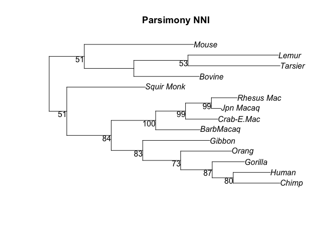

## Preparation

In this lab, we will learn how to use R to construct phylogenetic trees
using some basic algorithms, such as UPGMA and Neighbour-joining, etc.

Please download the nucleotide [alignment](ABCD.fasta), and save it into
your working directory. You can preview the alignment by using any text
editor to open the file.

We also need three R libraries: “ape”, “phangorn”, and “phytools”. If
your R has not got them, please use `install.packages` to install them.

## 1. Pairwise distances

Let’s load “ape” first into R:

    library(ape)

Make sure the the alignment file is in your working directory, then load
the alignment from the fasta file:

    # setwd("~/WorkSpace/BioSci700")
    alg = read.FASTA("ABCD.fasta")

This alignment has 4 taxa and 20 sites. The nucleotides were composited
to create the distance matrix in [Lecture
5](https://alexeidrummond.org/bayesian_phylo_lectures/lecture5/#/19).

Using the function `dist.dna` to compute the distribution of pairwise
distances, we can multiple it with the number of sites (20) to obtain
the matrix of pairwise distances.

    # 20 sites
    d = dist.dna(alg, model = "raw") * 20
    d

    ##    A  B  C
    ## B  8      
    ## C  7  9   
    ## D 12 14 13

**Question 1 :** what does this matrix tell us?

## 2. Algorithms

Secondly, we will use the library “phangorn” to create trees, and use
“phytools”.

    library(phangorn)
    library(phytools)

    ## Loading required package: maps

### 2.1 UPGMA

Now, please reuse the distance matrix `d` and compute the UPGMA tree.
Use `plot` function to draw the tree, and use `edgelabels` to show
branch lengths.

    treeUPGMA <- upgma(d)
    plot(treeUPGMA, use.edge.length=T, no.margin=TRUE)
    edgelabels(treeUPGMA$edge.length)

### 2.2 Neighbour-joining

Then compute the neighbour-joining tree. As it produces unrooted trees,
you need to add the “unrooted” argurment to the `plot` function.

    treeNJ <- NJ(d)
    plot(treeNJ, type="unrooted", use.edge.length=T, no.margin=TRUE)
    edgelabels(treeNJ$edge.length)

**Question 2 :** what is pros and cons of the neighbour-joining
algorithm?

### 2.3 Parsimony

To understand the parsimony method, we need a more complex example.
Please follow the instructions below, which are modified from the
“phangorn”
[tutorial](https://cran.r-project.org/web/packages/phangorn/vignettes/Trees.html).

First load the alignment “primates”, and remove the outgroup sequence
“Bovine” to make the analysis simple.

    fdir <- system.file("extdata/trees", package = "phangorn")
    primates <- read.phyDat(file.path(fdir, "primates.dna"), format = "interleaved")
    names(primates)

    ##  [1] "Mouse"      "Bovine"     "Lemur"      "Tarsier"    "Squir Monk"
    ##  [6] "Jpn Macaq"  "Rhesus Mac" "Crab-E.Mac" "BarbMacaq"  "Gibbon"    
    ## [11] "Orang"      "Gorilla"    "Chimp"      "Human"

    # rm "Bovine"
    primates <- primates[-2]
    names(primates)

    ##  [1] "Mouse"      "Lemur"      "Tarsier"    "Squir Monk" "Jpn Macaq" 
    ##  [6] "Rhesus Mac" "Crab-E.Mac" "BarbMacaq"  "Gibbon"     "Orang"     
    ## [11] "Gorilla"    "Chimp"      "Human"

We can now create the UPGMA and NJ tree respectively.

    dm  <- dist.ml(primates)
    treeUPGMA  <- upgma(dm)
    treeNJ  <- NJ(dm)

Then compare the parsimony score between two trees.

    parsimony(c(treeUPGMA, treeNJ), primates)

    ## [1] 676 676

**Question 3 :** which tree should we choose in term of the score? Why?

We use the UPGMA tree as a start, and perform nearest-neighbor
interchanges (NNI) to find the optimal tree.

    treePars <- optim.parsimony(treeUPGMA, primates, rearrangements = "NNI")

    plot(treePars, type="unrooted", use.edge.length=T, no.margin=TRUE)
    edgelabels(treePars$edge.length, 2)

### 2.4 Maximum likelihood

    dm <- dist.ml(primates, "F81")
    # NJ starting tree
    tree <- NJ(dm)

    # HKY + Γ(4)
    fitStart <- pml(tree, primates, k=4)
    fitHKY <- optim.pml(fitStart, model="HKY", optGamma=TRUE, rearrangement="stochastic")
    bs <- bootstrap.pml(fitHKY, bs=100, optNni=TRUE, multicore=TRUE)

    plotBS(midpoint(fitHKY$tree), bs, type="phylogram")

