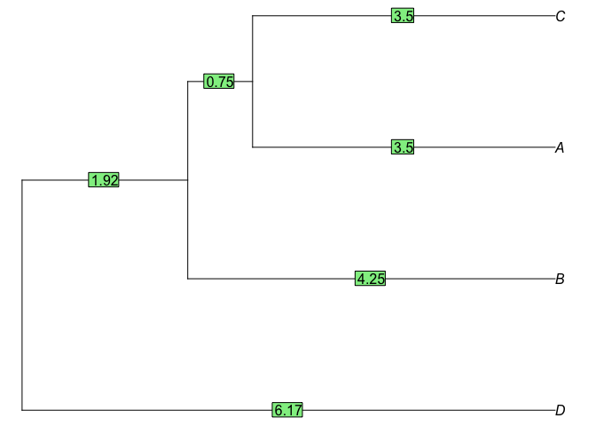
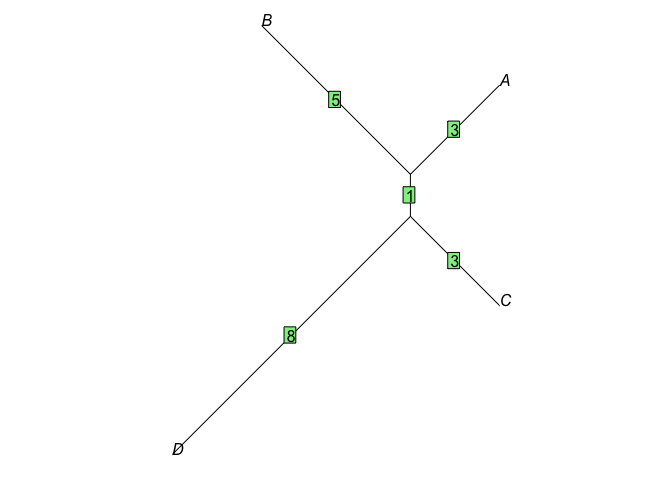
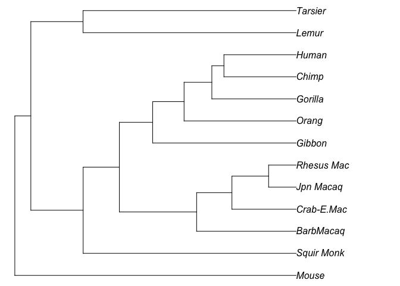
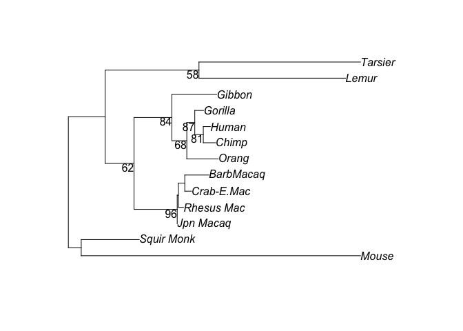
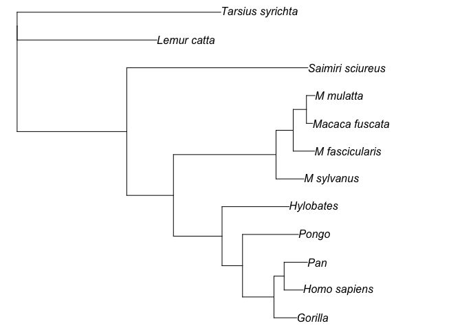

## Preparation

In this lab, we will learn how to use R to construct phylogenetic trees
using some basic algorithms, such as UPGMA and Neighbour-joining, etc.

Please download the nucleotide [alignment](ABCD.fasta), and save it into
your working directory. You can preview the alignment by using any text
editor to open the file.

We also need three R libraries: “ape”, “phangorn”, and “phytools”. If
your R has not got them, please use `install.packages` to install them.

## 1. Pairwise distances

Let’s load “ape” first into R:

    library(ape)

Make sure the the alignment file is in your working directory, then load
the alignment from the fasta file:

    # setwd("~/WorkSpace/BioSci700")
    aln = read.FASTA("ABCD.fasta")

This alignment has 4 taxa and 20 sites. The nucleotides were composited
to create the distance matrix in [Lecture
5](https://alexeidrummond.org/bayesian_phylo_lectures/lecture5/#/19).

Using the function `dist.dna` to compute the distribution of pairwise
distances, we can multiple it with the number of sites (20) to obtain
the matrix of pairwise distances.

    # 20 sites
    d = dist.dna(aln, model = "raw") * 20
    d

    ##    A  B  C
    ## B  8      
    ## C  7  9   
    ## D 12 14 11

**Question 1 :** what does this matrix tell us?

## 2. Algorithms

Secondly, we will use the libraries “phangorn” and “phytools” to create
and plot trees, and also select models. Please note you need to use
`read.phyDat` to load the data in this section. THe function
`read.FASTA` may cause errors for the code below, especially
`modelTest`.

    library(phangorn)
    library(phytools)

    ## Loading required package: maps

### 2.1 UPGMA

Now, please reuse the distance matrix `d` and compute the UPGMA tree.
Use `plot` function to draw the tree, and use `edgelabels` to show
branch lengths.

    treeUPGMA <- upgma(d)
    plot(treeUPGMA, use.edge.length=T, no.margin=TRUE)
    edgelabels(round(treeUPGMA$edge.length,2))

### 2.2 Neighbour-joining

Then compute the neighbour-joining tree. As it produces unrooted trees,
you need to add the “unrooted” argurment to the `plot` function.

    treeNJ <- NJ(d)
    plot(treeNJ, type="unrooted", use.edge.length=T, no.margin=TRUE)
    edgelabels(treeNJ$edge.length)

**Question 2 :** what is pros and cons of the neighbour-joining
algorithm?

### 2.3 Parsimony

To understand the parsimony method, we need a more complex example.
Please follow the instructions below, which are modified from the
“phangorn”
[tutorial](https://cran.r-project.org/web/packages/phangorn/vignettes/Trees.html).

First download the alignment [primates.fasta](primates.fasta), and then
load it using `read.phyDat`.

    primates <- read.phyDat("primates.fasta", format = "fasta", type = "DNA")
    names(primates)

    ##  [1] "Tarsius_syrichta" "Lemur_catta"      "Homo_sapiens"     "Pan"             
    ##  [5] "Gorilla"          "Pongo"            "Hylobates"        "Macaca_fuscata"  
    ##  [9] "M_mulatta"        "M_fascicularis"   "M_sylvanus"       "Saimiri_sciureus"

We can now create the UPGMA and NJ tree respectively.

    dm  <- dist.ml(primates)
    treeUPGMA  <- upgma(dm)
    treeNJ  <- NJ(dm)

The UPGMA tree looks like:

    plot(treeUPGMA, no.margin=TRUE)

The NJ tree looks like:

    plot(treeNJ, type="unrooted", no.margin=TRUE)

Print the parsimony scores.

    parsimony(c(treeUPGMA, treeNJ), primates)

    ## [1] 1153 1153

We then can give a starting tree, and perform nearest-neighbor
interchanges (NNI) to find the maximum parsimony tree.

    treePars <- optim.parsimony(treeUPGMA, primates, rearrangements = "NNI")

In the end, plot the maximum parsimony tree.

    plot(treePars, type="unrooted", no.margin=TRUE)

### 2.4 Model selection

When you make a data analysis using the model-based approach, you need
to know which model fits the best for the given data.

So we compare different nucleotide substitution models for “primates”.

    mt = modelTest(primates)

    mt

    ##      Model df    logLik      AIC          AICw     AICc         AICcw      BIC
    ## 1       JC 21 -6424.202 12890.40 5.776578e-308 12891.46 8.047355e-308 12991.21
    ## 2     JC+I 22 -6277.781 12599.56 8.268615e-245 12600.72 1.094749e-244 12705.17
    ## 3     JC+G 22 -6272.469 12588.94 1.676253e-242 12590.09 2.219328e-242 12694.54
    ## 4   JC+G+I 23 -6270.538 12587.08 4.254397e-242 12588.34 5.340414e-242 12697.48
    ## 5      F81 24 -6284.996 12617.99 8.232323e-249 12619.37 9.773868e-249 12733.20
    ## 6    F81+I 25 -6117.436 12284.87 1.783726e-176 12286.36 1.998148e-176 12404.88
    ## 7    F81+G 25 -6106.185 12262.37 1.373270e-171 12263.86 1.538351e-171 12382.37
    ## 8  F81+G+I 26 -6104.500 12261.00 2.725220e-171 12262.61 2.873436e-171 12385.80
    ## 9      K80 22 -6142.429 12328.86 5.011788e-186 12330.01 6.635515e-186 12434.46
    ## 10   K80+I 23 -5974.905 11995.81 1.048150e-113 11997.07 1.315711e-113 12106.21
    ## 11   K80+G 23 -5950.874 11947.75 2.865018e-103 11949.01 3.596370e-103 12058.15
    ## 12 K80+G+I 24 -5950.597 11949.19 1.390521e-103 11950.57 1.650903e-103 12064.40
    ## 13     HKY 25 -5981.720 12013.44 1.556217e-117 12014.93 1.743290e-117 12133.44
    ## 14   HKY+I 26 -5768.004 11588.01  3.746022e-25 11589.62  3.949755e-25 11712.81
    ## 15   HKY+G 26 -5712.072 11476.14  7.323769e-01 11477.75  7.722084e-01 11600.95
    ## 16 HKY+G+I 27 -5713.339 11480.68  7.582086e-02 11482.42  7.506371e-02 11610.28
    ## 17     SYM 26 -5989.382 12030.76 2.694652e-121 12032.38 2.841205e-121 12155.57
    ## 18   SYM+I 27 -5844.315 11742.63  9.951246e-59 11744.37  9.851872e-59 11872.23
    ## 19   SYM+G 27 -5821.757 11697.51  6.230636e-49 11699.25  6.168417e-49 11827.12
    ## 20 SYM+G+I 28 -5820.776 11697.55  6.115290e-49 11699.42  5.670709e-49 11831.96
    ## 21     GTR 29 -5934.148 11926.30  1.303952e-98 11928.30  1.129782e-98 12065.50
    ## 22   GTR+I 30 -5757.269 11574.54  3.151727e-22 11576.68  2.545216e-22 11718.54
    ## 23   GTR+G 30 -5709.633 11479.27  1.536484e-01 11481.41  1.240807e-01 11623.27
    ## 24 GTR+G+I 31 -5710.026 11482.05  3.815379e-02 11484.34  2.864726e-02 11630.86

As you can see, the “GTR+G” model has the best likelihood for
“primates”. Therefore, we should choose it to run the phylogenetic
analysis on this data.

### 2.5 Maximum likelihood

The scripts below are using the maximum likelihood approach to estimate
the parameters from “primates” data, and eventually create a maximum
likelihood phylogenetic tree from the inference.

First we create a NJ tree using F81 model as the starting tree.

    dm <- dist.ml(primates, "F81")
    # NJ starting tree
    tree <- NJ(dm)

Then we define the model to GTR + Γ(4) as the model selection suggested
and optimise the parameters.

    fitStart <- pml(tree, primates, k=4)
    fitGTR <- optim.pml(fitStart, model="GTR", optGamma=TRUE, rearrangement="stochastic")

The result is:

    fitGTR

    ## 
    ##  loglikelihood: -5709.666 
    ## 
    ## unconstrained loglikelihood: -4184.818 
    ## Discrete gamma model
    ## Number of rate categories: 4 
    ## Shape parameter: 0.3961116 
    ## 
    ## Rate matrix:
    ##           a         c         g         t
    ## a  0.000000  4.615633 45.005744  3.699251
    ## c  4.615633  0.000000  2.622149 38.945073
    ## g 45.005744  2.622149  0.000000  1.000000
    ## t  3.699251 38.945073  1.000000  0.000000
    ## 
    ## Base frequencies:  
    ## 0.3494849 0.3193111 0.08526572 0.2459383

Tips: you can use the command `str(fitGTR)` to list all available items
inside “fitGTR”.

As you can see, the result is an unrooted phylogenetic tree.

    is.rooted(fitGTR$tree) 

    ## [1] FALSE

    plot(fitGTR$tree, type="unrooted")

If you want to root the tree, one simple method is to use the function
`root` and specify the outgroup.

    rt <- root(fitGTR$tree, outgroup = c("Tarsius_syrichta","Lemur_catta"), resolve.root = TRUE)

The rooted maximum likelihood tree looks like:

    plot(rt, use.edge.length=T, no.margin=TRUE)

Add the command `edgelabels(round(rt$edge.length, 2))` to show all
branch lengths.

## Assigment (15 marks)

Please download the [H5N1 data](H5N1.fasta), which is a subset of
original dataset [Wallace et al.,
2007](https://doi.org/10.1073/pnas.0700435104). It consists of 43
influenza A H5N1 hemagglutinin and neuraminidase gene sequences isolated
from a variety of hosts 1996 - 2005 across sample locations.

Read the publication, and then make the following analyses:

1.  Use the R code that you have learnt to choose the “best” model for
    this data, and explain why you choose it. Please attach your R code
    with the report.

2.  Install the latest version of
    [RAxML](https://github.com/stamatak/standard-RAxML/tags), and create
    the maximum likelihood tree by using the model that you choose in
    the 1st step. You need to use the information provided in the
    publication to specify the outgroup taxon/taxa. Please record your
    command to run the analysis, and visualize the tree in the report.

    Tips: Use `-m` to define your model, and use `-#` or `-N` to specify
    multiple runs on distinct starting trees. It may take about several
    minutes for 10 runs on this data set using the single-threaded SSE3
    version. Use `-o` to specify the outgroup. More details are
    available in the manual. You can plot the tree and colour the tips
    in R. But if you prefer to use a software with GUI, we recommend
    [FigTree](http://tree.bio.ed.ac.uk/software/figtree/). The mapping
    file [locations.txt](locations.txt) can be used to colour the tips.

3.  Install another software
    [TempEst](http://tree.bio.ed.ac.uk/software/tempest/) to investigate
    the temporal signal at your ML tree. Then find the “best-fitting
    root” and attach the visualized tree (coloured by locations) in the
    report. Please record statistical results for both trees, the ML
    tree in step 2 and the best-fitting tree, and also explain the
    implication of these statistical results.

    Tips: Click “Parse Date” and use “prefix” `_` to load years from
    taxon labels into the program.

4.  Look at the “best-fitting” rooted tree, try to explain several
    important migration events according to the phylogeny.

5.  Write a full report to describe your analysis and explain the
    results, including the required answers from previous steps.
