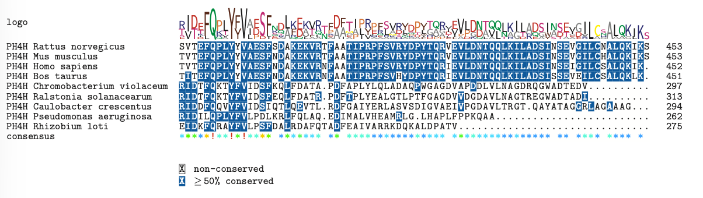

# Assignment1: Alignment and Phylogenetic Reconstruction (25 points)

**Due date:** Mon 2/4/2026 at 23:59

## Lab Introduction and Objectives

Welcome to this lab on sequence alignment and phylogenetic reconstruction. You will gain hands-on experience with the core computational methods used in molecular evolution — from pairwise alignment and multiple sequence alignment (MSA) to phylogenetic tree building and evolutionary rate estimation. Each section combines guided implementation with open-ended interpretation, so that you develop both practical coding skills and the biological reasoning needed to critically evaluate your results.
Please follow the submission instructions below before starting:

1. **File naming:** Save this file with your name and student ID: `Lab1_YourName_UPI.Rmd`
2. **Code blocks:** Complete the code in the designated areas marked with `### Your code here` and `### Your code finished above`
3. **Questions:** Answer all questions in the provided text blocks marked with 
```
Your answer here
```
4. **Reproducibility:** Ensure all code runs in R 4.2.x or later without errors before submission
5. **Documentation:** Comment your code clearly so that your reasoning is visible to the marker


## Learning Objectives

By the end of this lab, you will be able to:

1. Perform and interpret pairwise sequence alignment using global and local algorithms
2. Run multiple sequence alignment using ClustalW, ClustalOmega, MUSCLE, and MAFFT, and evaluate the results quantitatively
3. Quantify alignment disagreement using homology statement sets and symmetric difference
4. Construct and compare phylogenetic trees using UPGMA, neighbour-joining, and maximum parsimony
5. Estimate evolutionary rates from pairwise genetic distances using linear regression


---


# Set up 

We will use the following R libraries in this lab. These libraries can be installed using either the `install.packages()` function or `BiocManager::install()`. A complete installation script [Setup.R](https://raw.githubusercontent.com/walterxie/BioSci700/refs/heads/main/Lab1/Setup.R) is available for download. Please update the working directory path to your local directory, which should contain all data files and this lab file.

```{r, setup, include=FALSE}
library(Biostrings)
library(msa)
library(tidyverse)
library(ape)
library(phangorn)
library(phytools)

# please replace to your working dir
knitr::opts_knit$set(root.dir = "~/WorkSpace/BioSci700/Lab1")
```


# Section 1: pairwise alignment algorithms (5 points)

Load two DNA sequences.

```{r demo_sequences}
# Create example sequences
seq1 <- DNAString("ACGTTAGCTAGCTACGT")
seq2 <- DNAString("TTTTTAGCTAGCTACGTAAAAAACCCCC")
```

Define the substitution matrix. Try to run the command without `baseOnly = TRUE` in a different R session to discover the difference.

```{r demo_substitutionMatrix}
substitutionMatrix = nucleotideSubstitutionMatrix(match = 2, mismatch = -1, baseOnly = TRUE)
print(substitutionMatrix)
```

Needleman-Wunsch algorithm for global alignment.

```{r demo_global_alignment}
# Perform pairwise global alignment using pairwiseAlignment()
# Use the following parameters: match = 2, mismatch = -1, gapOpening = -2, gapExtension = -1
global_align <- pairwiseAlignment(seq1, seq2, 
                                  type="global", 
                                  substitutionMatrix = substitutionMatrix,
                                  gapOpening = -2, 
                                  gapExtension = -1)

# Display the alignment
print(global_align)

# Extract alignment details
align_score <- score(global_align)
align_seq1 <- alignedPattern(global_align)
align_seq2 <- alignedSubject(global_align)

cat("\nAlignment Score:", align_score, "\n")
```

Local alignment.

```{r demo_local_alignment}
# Perform local alignment using pairwiseAlignment
local_alig <- pairwiseAlignment(pattern = seq1, subject = seq2,
                                type = "local",            # Local alignment
                                substitutionMatrix = substitutionMatrix,
                                gapOpening = -2,
                                gapExtension = -1)

# Display the alignment
print(local_alig)

# Extract alignment details
align_score <- score(local_alig)
cat("\nAlignment Score:", align_score, "\n")
```

**Question 1a (2 point):** 
What is the __conserved region__ between these two sequences? Identify whether a global or local alignment algorithm is more appropriate for locating this specific segment. Additionally, name widely-used bioinformatics software tool that utilizes this algorithmic approach.  

```
Your answer here
```

**Question 1b (1 point):** 
If we want to introduce gaps within the first few characters for the global alignment from the same two sequences, what the parameter(s) should be changed? Write the code below and show the result:

```{r question_gaps}
### Your code here


### Your code finished above
```


**Question 1c (2 point):** 
How is an alignment score used to evaluate the quality of a result? Compare the score from Question 1b with the previous score (labeled demo_global_alignment) and examine the resulting alignments. Explain the reasoning behind why a higher numerical score can sometimes produce a biologically inaccurate or 'worse' result.

_Tip:_ in most biological contexts, substitutions (point mutations) generally occur much more frequently than indels (insertions and deletions).

```
Your answer here
```

---

# Section 2: multiple sequence alignment (MSA) methods (10 points)

This section explores different multiple sequence alignment algorithms and their applications.
We use a built-in dataset "exampleAA.fasta" from the `msa` package, which contains the unaligned amino acid sequences representing prolyl 4-hydroxylase alpha subunits (often denoted as PH4H_...) from various organisms, including Homo sapiens, Rattus norvegicus, Mus musculus, and others.


```{r exampleAA}
library(msa)
library(Biostrings)

# Load the built-in example sequences 
filepath <- system.file("examples", "exampleAA.fasta", package = "msa")
sequences <- readAAStringSet(filepath)

# Inspect the sequences before aligning
print(sequences)
nchar(sequences)   # note the unequal lengths — a realistic challenge for aligners
```


## Exercise 2.1: basic MSA with different algorithms (4 points)

Perform MSA on the unaligned amino acid sequences using three methods and print the results.

```{r msa}
# Run all three algorithms
msa_clustalw  <- msa(sequences, method = "ClustalW")
msa_clustalom <- msa(sequences, method = "ClustalOmega")
msa_muscle    <- msa(sequences, method = "Muscle")
```

Install MAFFT from https://mafft.cbrc.jp/alignment/software/, and then use the following command line to create the alignment file, named as "exampleAA_mafft.fasta".

```bash
mafft --auto --out exampleAA_mafft.fasta exampleAA.fasta
```

After the software finishes, use the following R code to load the alignment.

```{r mafft}
fileAA_mafft <- file.path(getwd(), "exampleAA_mafft.fasta")
mafftAA <- readAAStringSet(fileAA_mafft)
msa_mafft <- as(AAMultipleAlignment(as.character(mafftAA)), "MsaAAMultipleAlignment")
```

Check your alignments.

```{r msa_len}
# Print a summary of each alignment
#print(msa_clustalw,  show = "complete")
#print(msa_clustalom, show = "complete")
#print(msa_muscle,    show = "complete")
#print(msa_mafft,    show = "complete")

# Compare alignment widths (number of columns including gaps)
cat("ClustalW width    :", msa_clustalw@unmasked@ranges@width[1], "\n")
cat("ClustalOmega width:", msa_clustalom@unmasked@ranges@width[1], "\n")
cat("MUSCLE width      :", msa_muscle@unmasked@ranges@width[1], "\n")
cat("MAFFT width      :", msa_mafft@unmasked@ranges@width[1], "\n")
```


Use either R function `msaPrettyPrint()` or [Jalview](https://www.jalview.org) to visualize one of alignments.
Note: `msaPrettyPrint()` requires a working LaTeX installation. 

```
# Pretty-print each alignment to PDF for comparison
msaPrettyPrint(your_alignment,  output = "pdf", askForOverwrite = FALSE,
               file = "clustalw_aln.pdf",  showNames = "left", showLogo = "top")
```

**Question 2a (2 points):**
Select one alignment to produce two image files, first one is the whole alignemnt, which either the exported image from Jalview or the PDF generated by `msaPrettyPrint()`. The second is a screenshot of the first 50 columns to replace "my_example.png". Both images must be included in your submission.

```{r image-caption, echo=FALSE, fig.cap="Alignment visualisation", out.width="70%", fig.align="center"}
#getwd()
# Replace 'my_example.png' with your own alignment image.
# The first 50 columns are sufficient, but ensure taxa names remain visible.

```

Then, based on your visualisation, describe the distribution of conserved regions, and discuss which biological features most likely account for the pattern you observe.

```
Your answer here
```

## Exercise 2.2: MSA quality assessment (5 points)

Assess the quality of the three alignments using a quantitative scoring approach implemented by `msaConservationScore`.
It computes a sum-of-pairs (SP) score for each alignment column. For each column, it takes every pairwise combination of amino acids, looks up their score in the substitution matrix (e.g. BLOSUM62), and sums them all up:

```math
column score = Σ BLOSUM62(residue_i, residue_j)  for all pairs i < j
```

For example, if a column contains `[A, A, A, V]` across 4 sequences, it computes all 6 pairs: `A-A, A-A, A-V, A-A, A-V, A-V`, by looking each pair up in BLOSUM62 and summing the scores. A column where all sequences share the same amino acid scores high, but a column full of different amino acids or gaps scores low or negative.


```{r msaConservationScore}
data(BLOSUM62)
#print(BLOSUM62)

# msaConservationScore uses a substitution matrix (BLOSUM62) to score each column.
# Higher scores indicate more conserved / chemically similar residues in that column.
cs_clustalw  <- msaConservationScore(msa_clustalw,  substitutionMatrix = BLOSUM62)
cs_clustalom <- msaConservationScore(msa_clustalom, substitutionMatrix = BLOSUM62)
cs_muscle    <- msaConservationScore(msa_muscle,    substitutionMatrix = BLOSUM62)
cs_mafft     <- msaConservationScore(msa_mafft,     substitutionMatrix = BLOSUM62)

summary_scores <- data.frame(
  Method = c("ClustalW", "ClustalOmega", "MUSCLE", "MAFFT"),
  Width  = c(length(cs_clustalw), length(cs_clustalom), length(cs_muscle), length(cs_mafft)),
  Total_Score = c(sum(cs_clustalw), sum(cs_clustalom), sum(cs_muscle), sum(cs_mafft)),
  Mean_Score= round(c(mean(cs_clustalw), mean(cs_clustalom), mean(cs_muscle), mean(cs_mafft)), 3)
)

print(summary_scores)
```

**Question 2b (2 point):**

- Classify the four alignment methods above as either _progressive alignment_ or _iterative refinement_, and then  explain which of the two algorithm types would most likely produce a better-scoring alignment.
- Among "Width", "Total_Score", and "Mean_Score", identify which is the most reasonable measure for comparing alignment quality across methods.

```
Your answer here
```


You also can compute gap statistics to assess the alignments.

**Question 2c (2 point):**
Please complete the code below to compute four gap statistics for the alignment.
Each statistic is described in the comment above its corresponding line.

```{r gap_statistics}
# Helper function to compute gap statistics from an alignment
calc_gap_stats <- function(aln) {
  aln_matrix <- as.matrix(aln)
  n_seq      <- nrow(aln_matrix)
  n_col      <- ncol(aln_matrix)
  
  ###### 
  # Please complete the code below to compute four gap statistics for the alignment.
  # Each statistic is described in the comment above its corresponding line.
  ###### 
  
  ### your code here
  
  # Total gaps across entire alignment
  total_gaps <- NA
  
  # Percentage of cells that are gaps
  gap_pct <- NA
  
  # Number of columns containing at least one gap
  cols_with_gap <- NA
  
  # Number of fully conserved columns (no gaps, all same residue)
  fully_conserved <- NA
  
  ### your code finished above
  
  data.frame(
    Total_Gaps       = total_gaps,
    Gap_Pct          = gap_pct,
    Cols_With_Gap    = cols_with_gap,
    Fully_Conserved  = fully_conserved
  )
}

gap_clustalw  <- calc_gap_stats(msa_clustalw)
gap_clustalom <- calc_gap_stats(msa_clustalom)
gap_muscle    <- calc_gap_stats(msa_muscle)
gap_mafft    <- calc_gap_stats(msa_mafft)

summary_scores <- data.frame(
  Method = c("ClustalW", "ClustalOmega", "MUSCLE", "MAFFT"),
  Total_Gaps = c(gap_clustalw$Total_Gaps, gap_clustalom$Total_Gaps, gap_muscle$Total_Gaps, gap_mafft$Total_Gaps),
  Gap_Pct = c(gap_clustalw$Gap_Pct, gap_clustalom$Gap_Pct, gap_muscle$Gap_Pct, gap_mafft$Gap_Pct),
  Cols_With_Gap = c(gap_clustalw$Cols_With_Gap, gap_clustalom$Cols_With_Gap, gap_muscle$Cols_With_Gap, gap_mafft$Cols_With_Gap),
  Fully_Conserved = c(gap_clustalw$Fully_Conserved, gap_clustalom$Fully_Conserved, gap_muscle$Fully_Conserved, gap_mafft$Fully_Conserved)
)

print(summary_scores)
```

**Question 2d (1 point):**
- Considering all assessment metrics, identify which alignment method performs the best, and justify your decision by reporting the specific assessment results on which it is based.

```
Your answer here
```


## Exercise 2.3: symmetric difference of homology statement sets (4 points)

Each multiple sequence alignment makes a set of implicit evolutionary claims: every aligned column asserts that a specific position in one sequence is homologous to a specific position in another. Two alignments that produce different gap placements therefore disagree on which positions are evolutionarily equivalent, even if they look superficially similar. To quantify this disagreement, we use the `get_homology_statements()` function to extract the full set of homology pairs from each alignment, and `homology_sym_diff()` to measure how much any two alignments differ.

**Question 2e (2 point):**

Complete the code below.

```{r homology_statements}
# ── Core function: extract homology statements from one MSA ──────────────────
# This function extracts the set of homology statements implied by a multiple sequence alignment. 
# Each statement encodes that a specific residue position in one sequence is evolutionarily 
# equivalent to a specific position in another, because they co-occur in the same alignment column.

get_homology_statements <- function(aln) {
  # Note: taxa order could be diff in MSA, this will affect the result. 
  # Convert to AAStringSet (or DNAStringSet)
  # Sort the strings
  
  # Create a function col_to_ungapped to map alignment columns to ungapped positions 
  # For each sequence, build a vector mapping column index → ungapped position
  # Gaps (-) are assigned NA (no ungapped position)
  
  # Then, for each column, for each pair of sequences (A, B),
  # if both have a residue (not a gap), emit the homology statement:
  # "seqA:posA ~ seqB:posB"
  # Store as a character set for fast symmetric difference later
  
  ### your code here
  
  # ...
  
  ### your code finished above
}
```

Test your code. `eval=FALSE` tells knitr to display the code block in the knitted document but skip executing it entirely, so the incomplete `get_homology_statements()` function will not cause an error during knitting. Once the student completes the implementation they can remove `eval=FALSE` to run the test.

```{r homology_statements_test, echo=FALSE, eval=FALSE}
library(testthat)
test_that("get_homology_statements returns the exact expected statement set", {

  # 3 sequences × 10 columns
  #
  # Col:   1    2    3    4    5    6    7    8    9   10
  # SeqA:  A    C    D    E    -    F    G    H    I    K   <- internal gap col 5
  # SeqC:  -    -    -    -    -    F    G    H    I    K   <- leading gap block cols 1-5
  # SeqE:  A    C    -    E    -    F    G    -    -    -   <- scattered + trailing gaps
  #
  # Scenario per column:
  # col 1,2,4  : gap in SeqC only          -> 1 pair emits (SeqA/SeqE)
  # col 3      : gap in SeqC + SeqE        -> 0 pairs emit (SeqA alone)
  # col 5      : all three sequences gap   -> 0 pairs emit
  # col 6,7    : no gaps                   -> all 3 pairs emit
  # col 8,9,10 : gap in SeqE only          -> 1 pair emits (SeqA/SeqC)

  test_aln <- as(
    AAMultipleAlignment(c(
      SeqA = "ACDE-FGHIK",
      SeqC = "-----FGHIK",
      SeqE = "AC-E-FG---"
    )), "MsaAAMultipleAlignment"
  )

  expected <- c(
    # col 1: SeqC gap → SeqA/SeqE only
    "SeqA|1|SeqE|1",
    # col 2: SeqC gap → SeqA/SeqE only
    "SeqA|2|SeqE|2",
    # col 3: SeqC + SeqE gap → nothing emitted
    # col 4: SeqC gap → SeqA/SeqE only (note: SeqE ungapped pos = 3)
    "SeqA|4|SeqE|3",
    # col 5: all gap → nothing emitted
    # col 6: no gaps → all 3 pairs
    "SeqA|5|SeqC|1", "SeqA|5|SeqE|4", "SeqC|1|SeqE|4",
    # col 7: no gaps → all 3 pairs
    "SeqA|6|SeqC|2", "SeqA|6|SeqE|5", "SeqC|2|SeqE|5",
    # col 8: SeqE trailing gap → SeqA/SeqC only
    "SeqA|7|SeqC|3",
    # col 9: SeqE trailing gap → SeqA/SeqC only
    "SeqA|8|SeqC|4",
    # col 10: SeqE trailing gap → SeqA/SeqC only
    "SeqA|9|SeqC|5"
  )

  result <- get_homology_statements(test_aln)

  expect_setequal(result, expected)
})
```


```{r homology_sym_diff}
# ── Symmetric difference between two homology statement sets ────────────────
homology_sym_diff <- function(stmts_A, stmts_B) {
  
  set_A   <- as.character(stmts_A)
  set_B   <- as.character(stmts_B)
  
  only_A  <- setdiff(set_A, set_B)   # in A but not B (false positives of B)
  only_B  <- setdiff(set_B, set_A)   # in B but not A (false positives of A)
  shared  <- intersect(set_A, set_B) # homology statements both agree on
  
  list(
    n_A          = length(set_A),
    n_B          = length(set_B),
    n_shared     = length(shared),
    n_only_A     = length(only_A),   # SP-FP from B's perspective
    n_only_B     = length(only_B),   # SP-FN from B's perspective
    sym_diff     = length(only_A) + length(only_B),
    jaccard_dist = 1 - length(shared) /
      (length(set_A) + length(set_B) - length(shared))
  )
}
```


**Question 2f (1 point):**
Your task is to understand the outputs of these two functions and build a summary table/data frame to compare the results of four alignments generated by four different MSA methods above.
The code need to print this summary table, where the rows are the methods and the columns are the statistics created from two functions.
In addition, you need to answer which two MSA method produce the most similar alignments for this dataset. 


```{r homology_statements_results}
# ── Extract homology statements for all three alignments ────────────────────
cat("Extracting homology statements (this may take a moment)...\n")
  
  ### your code here
  
  # ...
  
  ### your code finished above
  
#print(results)
```


```
Your answer here
```

---

# Section 3: phylogenetic analysis - part 1 (5 points)

If your session is closed, please run the `setup` block to load libraries before continuing.

We will use the libraries “phangorn” and “phytools” to create and plot trees. 
Please note you need to use [Dengue virus data](./Dengue4.env.nex) to make the following analysis.

```{r Dengue4}
sq = read.nexus.data("Dengue4.env.nex")
# convert the list of vectors into DNAbin object
# so phangorn functions can take it as the input
dnaBin <- sq %>% lapply(.,paste0,collapse="") %>% 
  unlist %>% DNAStringSet %>% as.DNAbin 
```

## Exercise 3.1: pairwise genetic distances

```{r dist.ml}
dm  <- dist.ml(dnaBin)
# only first 6 taxa
print(as.matrix(dm)[1:6, 1:6])
```

**Question 3a (1 point):**
- What is the unit of pairwise distances return by `dist.ml`? 
- The El Salvador sequences appear twice — D4ElSal83 and D4ElSal94, collected 11 years apart. Show the process and result to calculate the approximate evolutionary rate (substitutions per site per year) between these two sequences using their pairwise distance and their collection year difference. 

```
Your answer
```

## Exercise 3.2: UPGMA

Now, we will compute the distance matrix d and produce the UPGMA tree. 
Use `plot` function to draw the tree, and use `edgelabels` to show branch lengths.

```{r}
dm  <- dist.ml(dnaBin)

treeUPGMA <- upgma(dm)
plot(treeUPGMA, use.edge.length=T, no.margin=TRUE)
edgelabels(round(treeUPGMA$edge.length,4)) 
```


## Exercise 3.3: neighbour-joining

Then compute the neighbour-joining tree. As it produces unrooted trees, 
you need to add the “unrooted” argument to the `plot` function.

```{r}
treeNJ <- NJ(dm)
plot(treeNJ, type="unrooted", use.edge.length=T, no.margin=TRUE)
#edgelabels(round(treeNJ$edge.length,4))
```
You can print the tree as the Newick format:

```{r newick}
cat(write.tree(treeNJ))
```


**Question 3b (2 points):** 
a. Identify the taxon with a negative branch length and record its name and branch length value below. 
b. What does a negative branch length mean biologically and computationally? 
c. How should it be handled before using the tree for downstream analysis?

```
Your answer
```

## Exercise 3.4:  Parsimony

Print the parsimony scores.

```{r}
parsimony(c(treeUPGMA, treeNJ), as.phyDat(dnaBin))
```

Which tree should be used as a starting tree?

We then use the UPGMA tree as a starting tree, and perform nearest-neighbor interchanges (NNI) to find the maximum parsimony tree.

```{r}
treePars <- optim.parsimony(treeUPGMA, as.phyDat(dnaBin), rearrangements = "NNI")
plot(treePars, type="unrooted")
```


## Exercise 3.5: Robinson-Foulds (RF) distance

The Robinson-Foulds (RF) distance is used to compare the topology of two phylogenetic trees by counting the number of splits (bipartitions) present in one tree but not the other. You can use `RF.dist` function in `phangorn` to compute this.

**Question 3c (2 points):**

```{r something_wrong}
RF.dist(treeUPGMA, treeNJ)

RF.dist(treeUPGMA, treePars)

RF.dist(treeNJ, treePars)
```

The code above runs in R without any error messages, but some of it contains conceptual mistakes. Identify at least one mistake and explain why it is incorrect.

```
Your answer
```

# Section 4: regression-based evolutionary rate estimation (5 points + 1 bonus)

## Background

The evolutionary rate is one of the most important parameters for biologist. One early heuristic approach to estimate it is use all pairwise distances simultaneously by fitting a linear regression of genetic distance against collection year difference. Under a strict molecular clock assumption, this relationship should be linear.

## Task

Using the distance matrix `dm` from Section 3 and the year-parsing code provided below, write an R script that performs a regression-based molecular clock estimation. You can either use the following three steps as a guide or completely write your own. 

## Implementation and interpretation 

Parse collection years from sequence names.
Each sequence name encodes a 2-digit year suffix (e.g. D4Thai78 = 1978). Use the provided `parse_year()` function to convert all sequence names into 4-digit collection years.

```{r parse_year}
# ── Parse year from sequence names ───────────────────────────────────────────
# Assumes 2-digit year suffix e.g. "D4Thai78" → 1978
parse_year <- function(name) {
  yr2 <- as.integer(substr(name, nchar(name) - 1, nchar(name)))
  ifelse(yr2 > 24, 1900 + yr2, 2000 + yr2)
}

seq_names <- labels(dm)
years     <- setNames(sapply(seq_names, parse_year), seq_names)
cat("Parsed years:\n")
print(years)
```

__Step 1__ — Build a tidy data frame of all unique pairwise comparisons **(2 points)**.

Construct a data frame with one row per unique sequence pair containing 4 columns: the columns "Seq_A" and "Seq_B" for the pair of sequence names, "Distance" (the pairwise distance from `dm`) and "Time_Diff" (the absolute difference in collection year between the two sequences). 

You could convert both matrices to long format and join, and then include only the lower triangle of the distance matrix to avoid counting each pair twice. The recommended data frame could look like:

```
Number of unique pairs: 136 
      Seq_A     Seq_B    Distance Time_Diff
1 D4Brazi82 D4ElSal83 0.002022928         1
2 D4Brazi82 D4ElSal94 0.011536079        12
3 D4ElSal83 D4ElSal94 0.010852552        11
```

Tips: 

- `outer()` can be used to create an n×n matrix of all pairwise absolute year differences.
- While `pivot_longer()` is the modern standard and a more general tool for converting to long format, `as.table()` is a classic Base R trick specifically for matrices. Both are perfectly acceptable.
- `rename()` in the `dplyr` package (already inlcuded in `tidyverse`) can be used to rename the column names of a data frame. 


```{r convert_and_join}
# ── Build year difference matrix and convert both matrices to long format ─────

# ── Convert both matrices to long format and join ────────────────────────────

  ### your code here
  
  # ...
  
  ### your code finished above

```


__Step 2__ — Fit a linear regression and report the three key statistics **(2 points)**.

Fit a linear model using a formula syntax to model "Distance" as a function of "Time_Diff".
Report "slope", "intercept", and "R-squared".


```{r linear_regression}
# ── Fit linear regression and report statistics ──────────────────────────────

  ### your code here
  
  # ...
  
  ### your code finished above

```

__Step 3__ — Interpret the result.

**Question 4a (1 point):** 
Based on the regression output, discuss the biological meaning of each statistic.

```
Your answer
```


## Visualization (Bonus 1 point)

Plot all pairwise comparisons as a scatter plot with the regression line overlaid using ggplot2. Your plot must include:

- Points with transparency
- A regression line with a 95% confidence interval ribbon
- Axis labels and a descriptive title
- An on-plot annotation showing the intercept, rate, and R²


```{r ggplot}
# ── Build annotation label ───────────────────────────────────────────────────

# ── ggplot ────────────────────────────────────────────────────────────────────

  ### your code here
  
  # ...
  
  ### your code finished above

#print(p)

# ── Save to PNG ───────────────────────────────────────────────────────────────
#ggsave( filename = "evolutionary_rate.png", plot = p, width = 8, height = 6 )
```


---

## Submission Checklist

- File is renamed with your name and student ID: Lab1_YourName_UPI.Rmd
- All code blocks are completed and run without errors
- All questions are answered with clear and thoughtful responses
- All plots and printed outputs are visible in the knitted document
- The document knits to HTML without errors
- All figures and .Rmd are included

### Grading Rubric

| Section | Component | Points |
|---|---|---|
| **Section 1** | Question 1a — conserved region and algorithm identification | 2 |
| | Question 1b — code to introduce gaps | 1 |
| | Question 1c — score interpretation and biological reasoning | 2 |
| **Section 1 total** | | **5** |
| **Section 2** | Question 2a — visualisation and conserved region description | 2 |
| | Question 2b — algorithm classification and best metric | 2 |
| | Question 2c — gap statistics implementation | 2 |
| | Question 2d — best alignment method with justification | 1 |
| | Question 2e — `get_homology_statements()` implementation | 2 |
| | Question 2f — summary table and most similar method pair | 1 |
| **Section 2 total** | | **10** |
| **Section 3** | Question 3a — distance units and manual rate calculation | 1 |
| | Question 3b — negative branch length identification and handling | 2 |
| | Question 3c — RF distance conceptual mistake | 2 |
| **Section 3 total** | | **5** |
| **Section 4** | Steps 1–2 — tidy data frame and regression implementation | 4 |
| | Question 4a — biological interpretation of regression statistics | 1 |
| | Bonus — ggplot2 visualisation with annotation | 1 |
| **Section 4 total** | | **5 + 1 bonus** |
| **Grand total** | | **25 + 1 bonus** |

---

*Submit both the .Rmd file and the knitted .html file through the course management system.*
