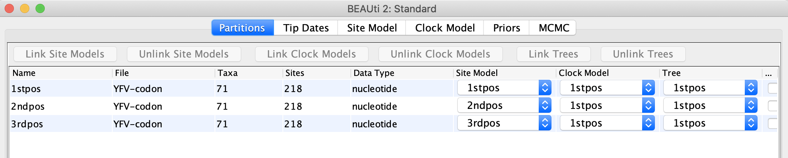
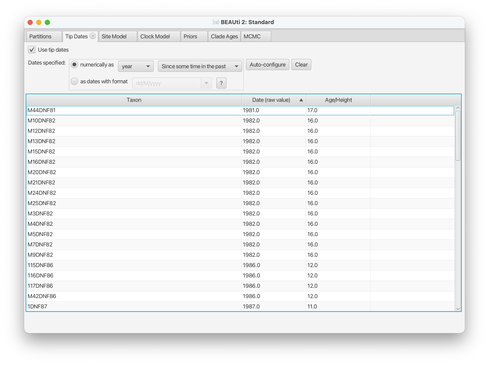
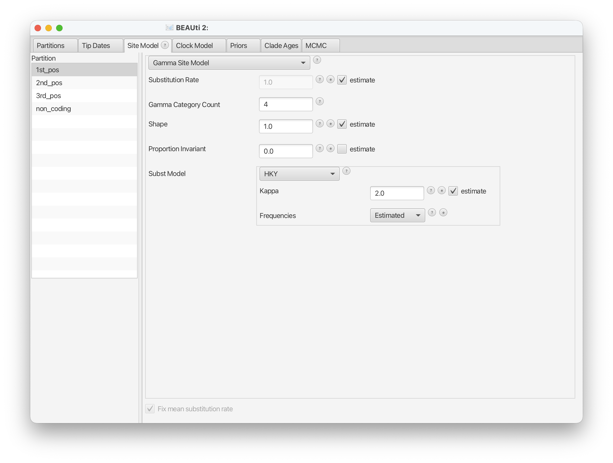
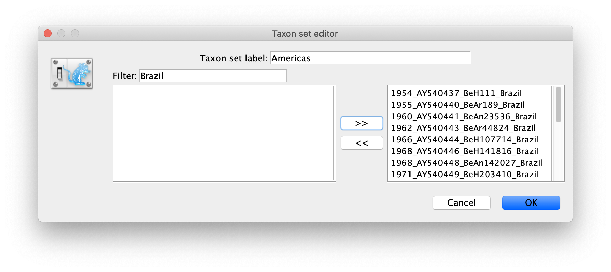
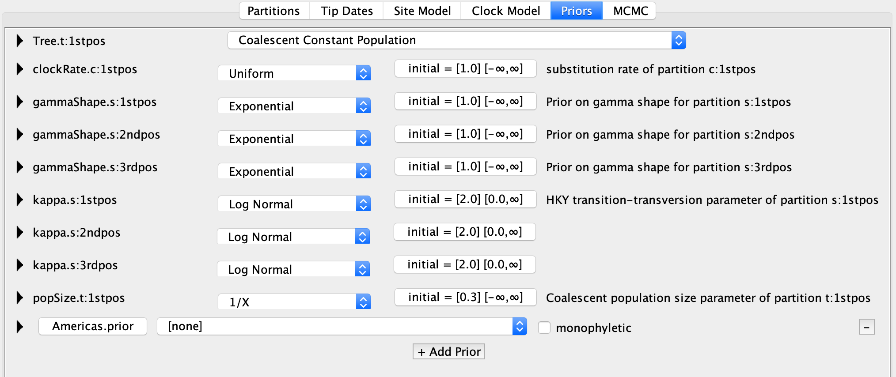

# BIOINF 702 Assignment 2

There are two parts to this assignment. 
In the first part, you will estimate phylogenies, rates and dates using tools in the BEAST software family. 
In the second part, you will briefly read and summarise an extension to the standard phylogenetic model. 
​
## Beast analysis of YFV data (9 Marks)
​
To complete the first part of the assignment, you will need to install:

1. BEAST 2 from [http://beast2.org/](http://beast2.org/). This package includes BEAST, BEAUti, Densitree and TreeAnnotator. 
Use the latest version 2.6.6.
2. FigTree v1.4.4 from [http://tree.bio.ed.ac.uk/software/figtree/](http://tree.bio.ed.ac.uk/software/figtree/) 
or IcyTree [http://tgvaughan.github.io/icytree/icytree.html](http://tgvaughan.github.io/icytree/icytree.html).
3. Tracer v1.7.2 from [http://tree.bio.ed.ac.uk/software/tracer/](http://tree.bio.ed.ac.uk/software/tracer/)

The data set required for this assignment is [YFV-codon.nex](YFV-codon.nex).
You can right-click your mouse on the link, and the popup-menu will show the option "Download Linked File As ...". 
Then click it and save the file to your working directory.

The data are 71 sequences from the prM/E gene of yellow fever virus (YFV) 
from African and South American countries with isolation dates ranging from 1940-2009.
The sequences represent a subset of the data set analyzed by Bryant et al. 
(Bryant JE, Holmes EC, Barrett ADT, 2007. 
[Out of Africa: A Molecular Perspective on the Introduction of Yellow Fever Virus into the Americas.](http://dx.doi.org/10.1371/journal.ppat.0030075)
PLoS Pathog 3(5): e75.).
​
The summary from the article states:

``
Throughout the 18th and 19th centuries, yellow fever was one of the most dreaded of diseases in New and Old world port cities. Large-scale epidemics of yellow fever helped shape colonial expansion in both the Americas and in Africa, and the medical and scientific developments associated with control of the virus have been a favored topic of historians for many years. The most commonly cited hypothesis of the origin of yellow fever virus (YFV) in the Americas is that the virus was introduced from Africa, along with Aedes Aegypti mosquitoes, in the bilges of sailing vessels during the slave trade. Although the hypothesis of a slave trade introduction is often repeated, it has not been subject to rigorous examination using gene sequence data and modern phylogenetic techniques for estimating divergence times. Herein we have assembled a comprehensive data set of gene sequences for YFV, which we used to infer the time-scale and evolutionary history of YFV. These data show that the spread of YFV to the Americas corresponds closely with the routes and timing of the slave trade. Overall, this study demonstrates how molecular epidemiological studies can provide new insight into debates on the origin and spread of infectious disease.
``

You will partially recreate the analysis in the paper to better understand the practice of evolutionary analyses using BEAST.

First, set up the model and MCMC run using BEAUti.

In BEAUti, import the alignment (`File` menu). Or drag and drop the download file into `Partitions` panel, 
and select `Import Alignment` from the pop-up window which is the last option in drop-down list.
If you like, you can view the actual data by double-clicking on the filename after it has loaded.

The file has defined the codon positions, so there are three partitions available in the panel.
We'll be fitting a different model to each of the three codon positions.
Now _link_ the tree models (i.e., use the same tree for all three positions)
and clock models, but leave the site models _unlinked_.



<figure class="image">

  <figcaption>Figure {{ current_fig_num }}: The Partitions panel in BEAUti.</figcaption>
</figure>

Now chose the `Tip Dates` tab.
The data are sampled at significantly different times (so-called "heterochronous") 
so check the `Use tip dates` option and click the button `Auto-config` to 
`use everthing before first _` option to automatically recover the sample times from the sequence names.



<figure class="image">

  <figcaption>Figure {{ current_fig_num }}: The TipDates panel in BEAUti.</figcaption>
</figure>

In the `Site Model` tab, specify a HKY with 4 Gamma categories with empirical frequencies for the stationary distribution.
Estimate the substitution rate, Gamma shape parameter and kappa. 
Make sure the `Fix mean substitution rate` option is checked.
Do this for each partition.  



<figure class="image">

  <figcaption>Figure {{ current_fig_num }}: The SiteModel panel in BEAUti.</figcaption>
</figure>

In the `Clock model` tab, select a `Strict Clock` and estimate the rate.

Under the `Priors` tab, choose a coalescent tree prior with a constant size population.
Leave all other priors at their default setting.

Also in this tab, you can specify taxon sets that you are interested in examining.
Click the `+ Add Prior` below the last the prior to get the `Taxon set editor` dialogue.
Choose all taxa that are sampled in the Americas and call this set `Americas`.
We are interested in whether or not this clade is monophyletic so do not impose a monophyly constraint on it.



<figure class="image">

  <figcaption>Figure {{ current_fig_num }}: The TaxonSet pop-up window in BEAUti.</figcaption>
</figure>

Tips: use the filter to select taxa by keywords.

<figure class="image">

  <figcaption>Figure {{ current_fig_num }}: The Priors panel in BEAUti.</figcaption>
</figure>

In the `MCMC` tab, choose a reasonable length to run your analysis for
(you may want to run short chains to start with to make sure your set-up is correct).
All parameters you log should have an ESS of at least 100.
It is also recommended to use the same logging frequencies between the trace log and tree log. 

Now save this setup as an xml file and run it using BEAST2.

Hand a report summarising the results of your run which answers all of the questions below
using graphs and figures where appropriate.
Also hand in a copy of your BEAST xml input file and and the resulting output files.
​
1. Check the convergence of your run using Tracer.  How can you tell your analysis has run for long enough? If you are not convinced that the analysis has run for long enough, run it for longer.
2. Why did we partition the alignment and fit 3 independent substitution models?  Do the estimated parameters suggest that this was necessary?  
3. What is the age of the most recent common ancestor for all samples? What is the age of the most recent common ancestor for the American samples?  How much support is there that the Americas clade monophyletic?  
4. Does the tree you estimate support the hypothesis that YFV was introduced a single time into the Americas? 
5. Here we are simultaneously estimating tree heights and clock rates.  What about the data allows us to do this?   What other forms of data would allow us to simultaneously make these estimates?
6. What happens if you don't fix the mean substitution rate to be 1 in the substitution model panel?  
7. Summarise the sampled trees as a maximum clade credibility tree using TreeAnnotator (and visualised in FigTree or IcyTree) and using Densitree.  What are the strengths and weaknesses of the two summary methods for this analysis?
8. Find a pair of estimated parameters that are positively correlated and a pair that are negatively correlated. Just based on the model used, would you have guessed before running the analysis that these pairs would be correlated?

The mapping file [locations2.txt](locations2.txt) can be used to colour the tips.

## Further phylogenetic models (6 Marks)

There are many other models implemented in BEAST (see [http://www.beast2.org/beast-features/](http://www.beast2.org/beast-features/)).
Choose one of the papers below and, in 2-3 pages, summarise it, describing the basic model, 
the type of data it requires, the assumptions it makes, 
the parameters that can be estimated and whether or not it could sensibly be applied to the YFV data set we look at here.

- A. J. Drummond, A. Rambaut, B. Shapiro and O. G. Pybus (2005) [Bayesian Coalescent Inference of Past Population Dynamics from Molecular Sequences](https://doi.org/10.1093/molbev/msi103).
- Joseph Heled, and Alexei J. Drummond (2010) [Bayesian Inference of Species Trees from Multilocus Data](http://mbe.oxfordjournals.org/content/27/3/570.full).
- Vaughan, Kuhnert, Popinga, D. Welch and A. J. Drummond (2014) [Efficient Bayesian inference under the structured coalescent](https://doi.org/10.1093/bioinformatics/btu201).
- Alexandra Gavryushkina , David Welch, Tanja Stadler, Alexei J. Drummond (2014) [Bayesian Inference of Sampled Ancestor Trees for Epidemiology and Fossil Calibration](https://doi.org/10.1371/journal.pcbi.1003919).
- Remco Bouckaert and Alexei J Drummond (2017) [bModelTest: Bayesian phylogenetic site model averaging and model comparison](https://doi.org/10.1186/s12862-017-0890-6).
- Muller NF, Rasmussen D, Stadler T (2018) [MASCOT: parameter and state inference under the marginal structured coalescent approximation](https://doi.org/10.1093/bioinformatics/bty406).
