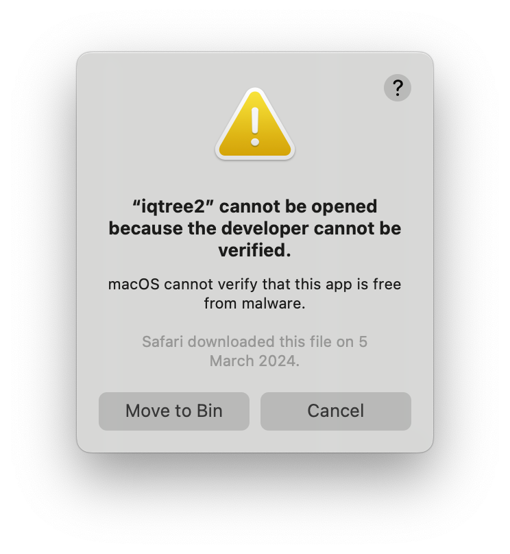
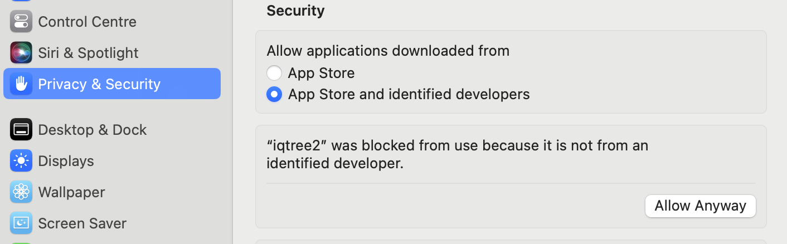
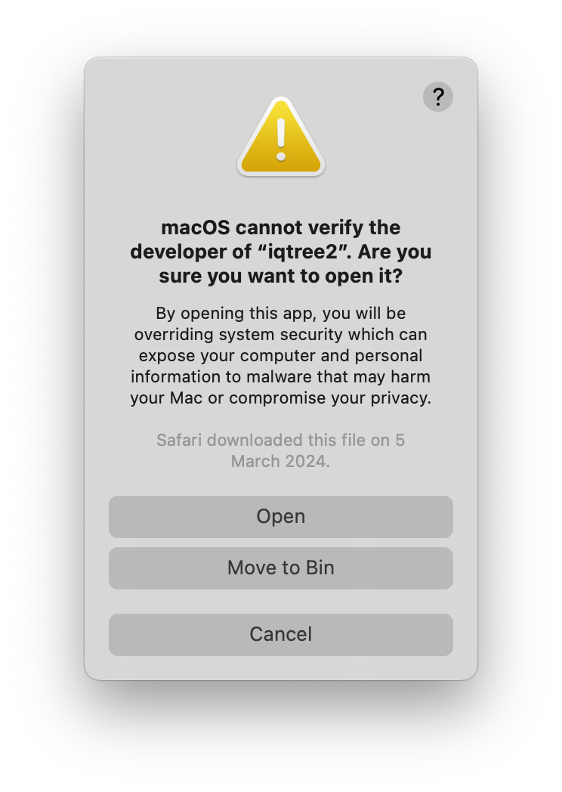

## Assignment 1

  1. [Assignment 1 - template](Assignment1/Assignment1Template.Rmd), 
  2. [tree2t.png](Assignment1/tree2t.png) for Question 2,
  3. [RSV2.nex](Assignment1/RSV2.nex) for Question 3.
  

Download the files and put them into the same directory.

Please follow the instruction to complete the assignment. 
Submit your original .Rmd file with the generated HTML file, 
including the downloaded alignment and figures, and also the generated tree files and figures.

To generate HTML from .Rmd file, you can go to "Knit options", 
and click the menu item [Knit to HTML](./Knit2HTML.png).


## Assignment 2

View the [template](Assignment2/Assignment2-template) by browser.

  1. <a href="https://github.com/walterxie/BioSci700/raw/main/Assignment2/Assignment2-template.md">Assignment 2 - template</a>, right-click the link and select "Download Linked File ...",
  2. Required figures [figs.zip](Assignment2/figs.zip) for the template.
  3. [RSV2.nex](Assignment2/RSV2.nex).

Download the files and put them into the same directory. 
Unzip the `figs.zip` and make sure all images under the subfolder `figs`, 
and the subfolder must be in the same directory with the `Assignment2-template.md` file.

Please follow the instruction in the template to complete the assignment. 

Please install all required software packages in advance, and test if they can open properly. 
This preparation will help optimise your time during the 2nd lab.


## Useful links

- [R examples](RExamples.html) or [R tutorial](https://www.w3schools.com/r/), and [R tutorial for vectorisation](https://sahirbhatnagar.com/biosR/vectorization-apply-and-for-loops.html)

- [Math in R markdown](https://rmd4sci.njtierney.com/math)

- [More R markdown](https://bookdown.org/yihui/rmarkdown/)

- [IcyTree](https://icytree.org)

- [FigTree](https://github.com/rambaut/figtree/releases)

- [BEAST 2](http://www.beast2.org)


## 3rd party software issues

### Resize a image in a .Rmd file in RStudio

`` may result in a large size when creating HTML from the .Rmd file. 
You may consider using the following code to replace it, which allows you to add a resized image: 

``


### Mac version issues

1. Cannot be opened

The latest version of macOS has implemented stricter security protocols for opening downloaded software. 
As a result, you may encounter the following error on a Mac:



To resolve the issue, navigate to "System Settings" => "Privacy & Security" => "Security" on your Mac, 
and select "Allow Anyway" for the software in question.



Afterwards, relaunch the application (for instance, iqtree2). 
When prompted, click "Open" in the pop-up window to proceed.




{:start="2"}
2. Incorrectly prompt for the installation of Java 1.6

Note that the Mac version of **TempEst** and **FigTree** may have an issue 
where they incorrectly prompt for the installation of Java 1.6. 
This is a known bug and does not affect the functionality of the programs. 
To run FigTree or TempEst, you can simply extract and launch the executable version
(e.g., FigTree_v1.4.4.tgz) without needing to install Java 1.6 separately.

To start FigTree, run the following command in the terminal: 

```bash
cd /Applications/FigTree1.4.4
bin/figtree 
```

If `figtree` is not executable in your machine, 
run the following command in the terminal before starting FigTree: 

```bash
chmod u+x bin/figtree
```


