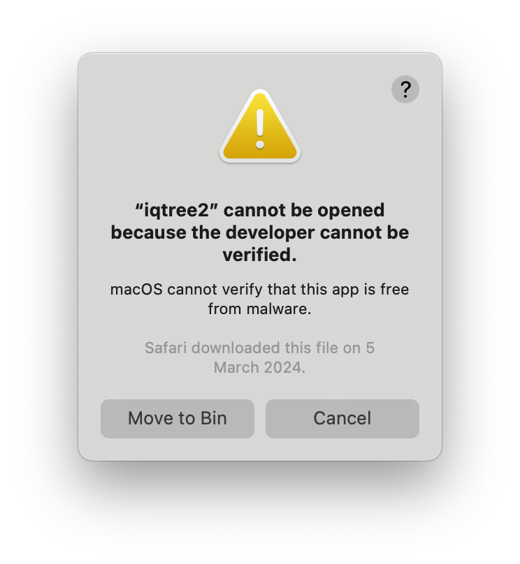
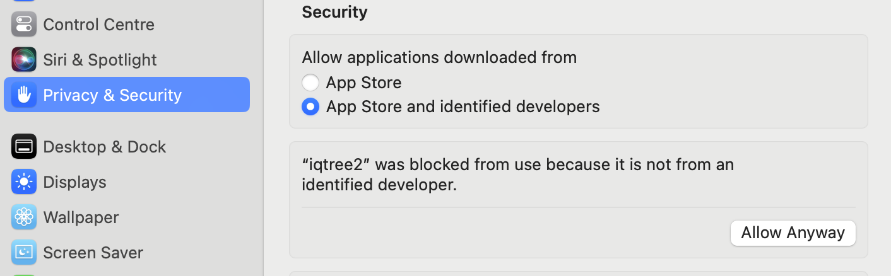
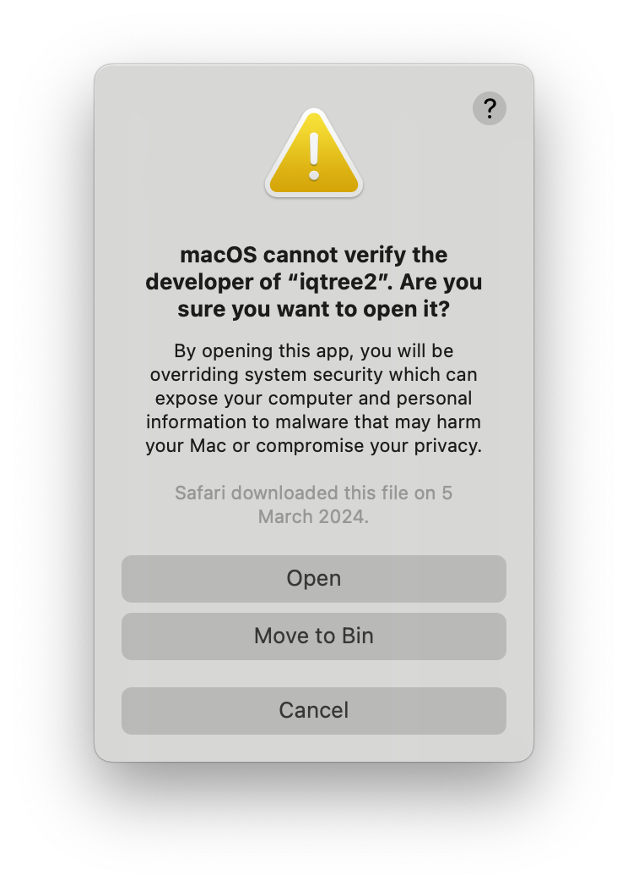

# BIOSCI 700: Phylogenetics

## Assignment 1

[Assignment 1](Lab1/Lab1.html) and [Assignment 1 Notebook](Lab1/Lab1.Rmd)

### Required Software

- [R >4.2.x](https://cran.r-project.org) and [R studio](https://posit.co/download/rstudio-desktop/);

- [MAFFT](https://mafft.cbrc.jp/alignment/software/) 

- [Jalview](https://www.jalview.org)

Required R packages:

- Download and run a installation script 
[Setup.R](https://raw.githubusercontent.com/walterxie/BioSci700/refs/heads/main/Lab1/Setup.R)
to install the required R packages.
Use `library()` to check if the installation is successful.

### Required data

- [exampleAA.fasta](Lab1/exampleAA.fasta)

- [Dengue4.env.nex](Lab1/Dengue4.env.nex)

### Homo state

- [Homo_state](Lab1/Homo_state.html)

## Assignment 2

- Read [Epidemic Dynamics Revealed in Dengue Evolution](https://doi.org/10.1093/molbev/msp285)

- [Assignment 2](Lab2/Lab2.html) and [Assignment 2 answer template](Lab2/Lab2_YOUR_NAME_UPI.md).

Use the provided `Lab2_YOUR_NAME_UPI.md` as a template — it contains all section headings and question blocks. You may use any editor (e.g. Word, Google Docs, or R studio) to complete it. Do not copy the full contents of this lab instruction; only fill in your answers and insert required figures in the designated blocks. Name your final report file using your name and student ID: `Lab2_YourName_UPI`. Submit as either a **PDF** or **HTML** file.

### Data

- [Dengue4.nex](Lab2/Dengue4.nex)

### Required Software

- [IQ-Tree >3.x](https://iqtree.github.io)

- [TempEst](https://tree.bio.ed.ac.uk/software/tempest/)

- [BEAST >2.7.7](https://www.beast2.org) and [CCD package (install from Package Manager)](https://www.beast2.org/managing-packages/)

- [Tracer >1.7.x](https://github.com/beast-dev/tracer/releases)

- [FigTree](https://github.com/rambaut/figtree/releases) or [IcyTree](https://icytree.org)

- TempEst, Tracer and FigTree requires Java 1.8 or higher. 

- [Beagle (optional)](https://github.com/beagle-dev/beagle-lib/wiki)


## Useful links

- [R examples](RExamples.html) or [R tutorial](https://www.w3schools.com/r/)

- [R full tutorial](https://www.geeksforgeeks.org/r-language/r-tutorial/) 

- [R tutorial for vectorisation](https://sahirbhatnagar.com/biosR/vectorization-apply-and-for-loops.html), 
and [apply(), lapply(), sapply(), and tapply() in R](https://www.geeksforgeeks.org/r-language/apply-lapply-sapply-and-tapply-in-r/)

- [R tidyverse - data transformation](https://r4ds.hadley.nz/data-transform.html) 
and [R tidyverse - data tidying](https://r4ds.hadley.nz/data-tidy.html)

- [R tutorial joins](https://r4ds.hadley.nz/joins.html#sec-mutating-joins)

- [R ggplot2](https://ggplot2.tidyverse.org/articles/ggplot2.html)

- [Math in R markdown](https://rmd4sci.njtierney.com/math)

- [More R markdown](https://bookdown.org/yihui/rmarkdown/)

- [IcyTree](https://icytree.org)

- [FigTree](https://github.com/rambaut/figtree/releases)

- [BEAST 2](http://www.beast2.org)


## 3rd party software issues

### Resize a image in a .Rmd file in RStudio

`` may result in a large size when creating HTML from the .Rmd file. You may
consider using the following code to replace it, which allows you to add a resized image:

``


### Mac version issues

1. Cannot be opened

The latest version of macOS has implemented stricter security protocols for opening downloaded
software. As a result, you may encounter the following error on a Mac:



To resolve the issue, navigate to "System Settings" => "Privacy & Security" => "Security" on your
Mac, and select "Allow Anyway" for the software in question.



Afterwards, relaunch the application (for instance, iqtree2). When prompted, click "Open" in the
pop-up window to proceed.




{:start="2"} 
2. Incorrectly prompt for the installation of Java 1.6

Note that the Mac version of **TempEst** and **FigTree** may have an issue where they incorrectly
prompt for the installation of Java 1.6. This is a known bug and does not affect the functionality
of the programs. To run FigTree or TempEst, you can simply extract and launch the executable version
(e.g., FigTree_v1.4.4.tgz) without needing to install Java 1.6 separately.

To start FigTree, run the following command in the terminal:

```bash cd /Applications/FigTree1.4.4 bin/figtree ```

If `figtree` is not executable in your machine, run the following command in the terminal before
starting FigTree:

```bash chmod u+x bin/figtree ```


